# 765T Agentic BIM OS - Product Blueprint

> **Version:** 1.0 | **Date:** 2026-03-22
>
> **Mission:**
> *"Chung toi ship AI Agent toi ban — BIM khong gioi han, nang cao hieu suat cua ban va du an."*
>
> Day la tai lieu goc (single source of truth) cho toan bo tam nhin san pham,
> kien truc ky thuat, va flow hoat dong cua he sinh thai 765T.

---

## MUC LUC

1. [Brand Identity](#1-brand-identity)
2. [765T Smart Onboarding](#2-765t-smart-onboarding)
3. [765T Hub - Bo nao du an](#3-765t-hub)
4. [765T Scan - Quet doc quyen](#4-765t-scan)
5. [765T Flow - Stream realtime](#5-765t-flow)
6. [Vong lap su dung hang ngay](#6-vong-lap-hang-ngay)
7. [765T Connect - MCP Connectors](#7-765t-connect)
8. [Goc nhin: Drafter / BIMer](#8-drafter--bimer)
9. [Goc nhin: BIM Manager / Coordinator](#9-bim-manager--coordinator)
10. [Goc nhin: Pro Developer](#10-pro-developer)
11. [Kien truc ky thuat 5 lop](#11-kien-truc-ky-thuat)
12. [LLM Router - Toi uu chi phi](#12-llm-router)
13. [So sanh thi truong](#13-so-sanh-thi-truong)
14. [Product Checklist](#14-product-checklist)

---

## 1. Brand Identity

Moi tinh nang co ten rieng voi tien to **765T**, tao he sinh thai nhan dien thuong hieu.

| Ten | Vai tro | Mo ta |
|-----|---------|-------|
| **765T Worker** | AI Agent chinh | Tro ly BIM chay truc tiep trong Revit |
| **765T Scan** | Bo quet doc quyen | Quet toan bo Revit file, nen thong tin thong minh |
| **765T Hub** | Bo nao du an | Thu muc tai `%APPDATA%\BIM765T.Revit.Agent\workspaces\` luu project workspace cua MVP |
| **765T Flow** | Stream hoat dong | Hien thi realtime AI dang lam gi (nhu Claude Code) |
| **765T Connect** | He thong ket noi | MCP connectors toi ACC, Unifi, Excel, task tracker |
| **765T Audit** | Kiem tra chat luong | Multi-agent quet va cham diem model |
| **765T Scripts** | Kho script thong minh | AI tu tao, cache, tai su dung script |
| **765T Persona** | Tinh cach AI | Cau hinh giong noi, phong cach, chuyen mon |
| **765T Suggest** | Goi y thong minh | Tu dong goi y khi nguoi dung thao tac Revit |
| **765T Quick Actions** | Nut bam nhanh | Tuy chinh theo vai tro nguoi dung |

---

## 2. 765T Smart Onboarding

> Khong phai lenh `/init` trong terminal.
> Day la trai nghiem UI-first, tu dong, muot ma ngay trong Revit.

### 2a. Trigger khoi dong

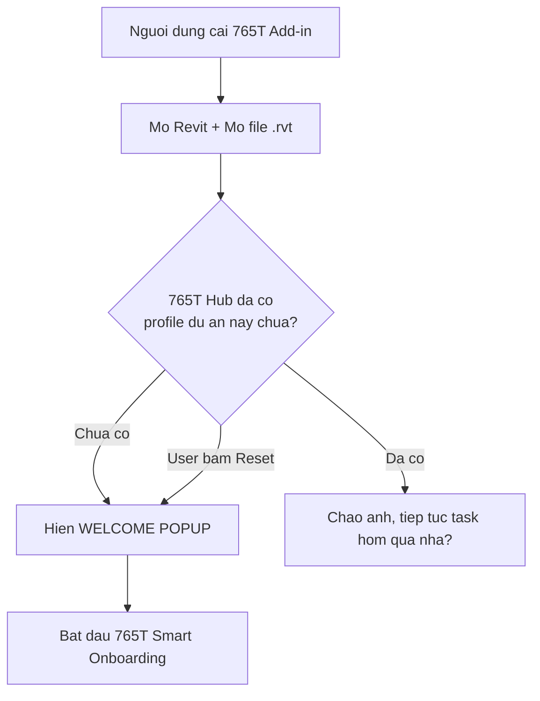
```mermaid
flowchart TD
    INSTALL["Nguoi dung cai 765T Add-in"] --> REVIT["Mo Revit + Mo file .rvt"]
    REVIT --> CHECK{"765T Hub da co\nprofile du an nay chua?"}

    CHECK -->|Chua co| POPUP["Hien WELCOME POPUP"]
    CHECK -->|Da co| RESUME["Chao anh, tiep tuc task hom qua nha?"]
    CHECK -->|User bam Reset| POPUP

    POPUP --> ONBOARD["Bat dau 765T Smart Onboarding"]
```

### 2b. Welcome Popup

> Thiet ke: 1 popup giua man hinh, nen trang, goc bo tron, toi gian.
> Khong co 10 truong input. Chi 1-2 buoc.

**Buoc 1 — Gioi thieu (3 giay)**

```
+--------------------------------------------------+
|                                                   |
|           765T Worker                             |
|           Tro ly BIM thong minh cua ban           |
|                                                   |
|     Em se quet nhanh du an cua anh de hieu        |
|     context. Chi mat khoang 15-30 giay.           |
|                                                   |
|          [ Bat dau ]    [ De sau ]                |
|                                                   |
+--------------------------------------------------+
```

**Buoc 2 — 765T Flow stream truc tiep (15-30 giay)**

> Nguoi dung THAY AI dang lam gi. Tao cam giac tin tuong.

```
+--------------------------------------------------+
|  765T Flow - Dang quet du an...                   |
|                                                   |
|  [ok] Doc thong tin file: ProjectABC_Central.rvt  |
|  [ok] Phat hien: Revit 2024, Central Model       |
|  [ok] Quet cau truc: 14 Levels, 8 Worksets       |
|  [ok] Quet Views: 234 views, 5 View Templates    |
|  [>>] Dang quet Sheets...                         |
|  [  ] Quet Families...                            |
|  [  ] Quet Links (CAD, RVT)...                    |
|  [  ] Quet Dynamo scripts...                      |
|  [  ] Tong hop bao cao...                         |
|                                                   |
|  ==============================-------  68%       |
|                                                   |
+--------------------------------------------------+
```

**Buoc 3 — 765T Project Brief**

> KHONG bao cao kieu "File co 2847 warnings, 156 worksets" — VO NGHIA.
> AI TOM TAT nhu mot nguoi hieu du an.

```
+--------------------------------------------------+
|  765T Project Brief                               |
|                                                   |
|  Du an: ProjectABC - Toa nha van phong 25 tang    |
|  Mang: MEP (Co-Dien-Nuoc)                        |
|  Phase hien tai: DD (Design Development)          |
|                                                   |
|  Em da hieu:                                      |
|  - 14 tang, chia 3 zone (A, B, C)                |
|  - MEP co 4 he thong: HVAC, Plumbing,            |
|    Fire Protection, Electrical                    |
|  - 5 View Templates chuan, nhat quan              |
|  - 12 Sheet da setup, con ~40 chua co             |
|  - Link 2 file Ket cau + 1 Kien truc             |
|  - 3 Dynamo script trong du an                    |
|  - Tieu chuan dat ten View:                       |
|    [Discipline]-[Level]-[Zone]-[System]           |
|                                                   |
|  Goi y:                                           |
|  - Anh co file BEP/tieu chuan cong ty khong?     |
|  - Anh thuong lam gi nhieu nhat?                  |
|    [ QC/Review ] [ Ve/Model ] [ Xuat ban ]        |
|    [ Quan ly ]   [ Tuy chinh ]                    |
|                                                   |
|                       [ Bat dau lam viec >> ]     |
+--------------------------------------------------+
```

### 2c. Onboarding Flow tong the

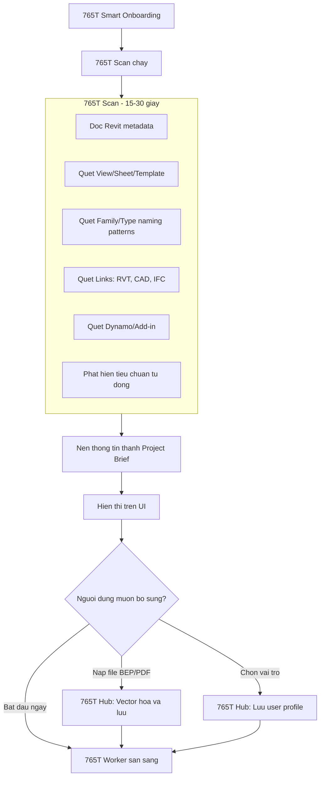
```mermaid
flowchart TD
    START["765T Smart Onboarding"] --> SCAN["765T Scan chay"]

    subgraph SCAN_PHASE ["765T Scan - 15-30 giay"]
        S1["Doc Revit metadata"]
        S2["Quet View/Sheet/Template"]
        S3["Quet Family/Type naming patterns"]
        S4["Quet Links: RVT, CAD, IFC"]
        S5["Quet Dynamo/Add-in"]
        S6["Phat hien tieu chuan tu dong"]
    end

    SCAN --> SCAN_PHASE
    SCAN_PHASE --> COMPRESS["Nen thong tin thanh Project Brief"]
    COMPRESS --> SHOW["Hien thi tren UI"]
    SHOW --> ASK{"Nguoi dung muon bo sung?"}

    ASK -->|Nap file BEP/PDF| INGEST["765T Hub: Vector hoa va luu"]
    ASK -->|Chon vai tro| PROFILE["765T Hub: Luu user profile"]
    ASK -->|Bat dau ngay| READY["765T Worker san sang"]

    INGEST --> READY
    PROFILE --> READY
```

### 2d. Agent thong minh dan theo thoi gian

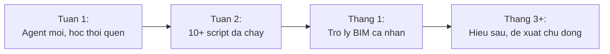
```mermaid
flowchart LR
    T1["Tuan 1:\nAgent moi, hoc thoi quen"] --> T2["Tuan 2:\n10+ script da chay"]
    T2 --> T3["Thang 1:\nTro ly BIM ca nhan"]
    T3 --> T4["Thang 3+:\nHieu sau, de xuat chu dong"]
```

---

## 3. 765T Hub

> MVP shipping root: `%APPDATA%\BIM765T.Revit.Agent\`
> Project workspace root: `%APPDATA%\BIM765T.Revit.Agent\workspaces\`
> `workspaces/default/workspace.json` trong repo chi la seed/dev baseline, khong phai runtime root cua user.

> Thu muc machine-local cua MVP la `%APPDATA%\BIM765T.Revit.Agent\` thay vi `%USERPROFILE%/.765t/`
> KHONG de canh file .rvt (file central la cua ca team, khong tao thu muc la tren server).

### 3a. Cau truc thu muc

```
C:\Users\[TenUser]\AppData\Roaming\BIM765T.Revit.Agent\
|
|-- settings.json                  <- Cau hinh runtime tren may user
|-- policy.json                    <- Guardrail / capability policy
|
|-- workspaces\
|   |-- [ProjectHash_ABC]\
|   |   |-- brief.json             <- 765T Project Brief (ket qua Scan)
|   |   |-- standards.json         <- Tieu chuan phat hien + user bo sung
|   |   |-- paths.json             <- Duong dan quan trong (rvt, bep, excel)
|   |   |-- session_state.json     <- Task dang do
|   |   |-- task_history\          <- Lich su tac vu theo ngay
|   |   |   +-- 2026-03-22.jsonl
|   |   +-- lessons.jsonl          <- Bai hoc tich luy
|   |
|   +-- [ProjectHash_XYZ]\
|       +-- ...
|
|-- knowledge\
|   |-- bep\                       <- Vector DB tu file BEP/PDF
|   |   |-- index.db               <- SQLite FTS5
|   |   +-- vectors.bin            <- Embeddings (model nhe, local)
|   |-- company_std\               <- Tieu chuan cong ty (dung chung)
|   +-- user_docs\                 <- Tai lieu nguoi dung upload
|
|-- scripts\
|   |-- cache\                     <- Script AI da tao va verified
|   |   |-- renumber_doors.py
|   |   +-- export_schedule.dyn
|   +-- marketplace\               <- Script tai tu cong dong
|
+-- logs\
    |-- activity.jsonl             <- Log hoat dong
    +-- errors.jsonl               <- Log loi
```

### 3b. Logic doc file cua AI — Thu tu uu tien

> AI khong doc moi thu moi lan. Co thu tu uu tien ro rang.

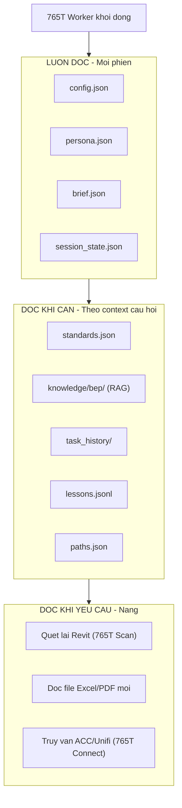
```mermaid
flowchart TD
    START["765T Worker khoi dong"] --> L1

    subgraph L1 ["LUON DOC - Moi phien"]
        R1["config.json"]
        R2["persona.json"]
        R3["brief.json"]
        R4["session_state.json"]
    end

    L1 --> L2

    subgraph L2 ["DOC KHI CAN - Theo context cau hoi"]
        R5["standards.json"]
        R6["knowledge/bep/ (RAG)"]
        R7["task_history/"]
        R8["lessons.jsonl"]
        R9["paths.json"]
    end

    L2 --> L3

    subgraph L3 ["DOC KHI YEU CAU - Nang"]
        R10["Quet lai Revit (765T Scan)"]
        R11["Doc file Excel/PDF moi"]
        R12["Truy van ACC/Unifi (765T Connect)"]
    end
```

### 3c. Tu dong cap nhat

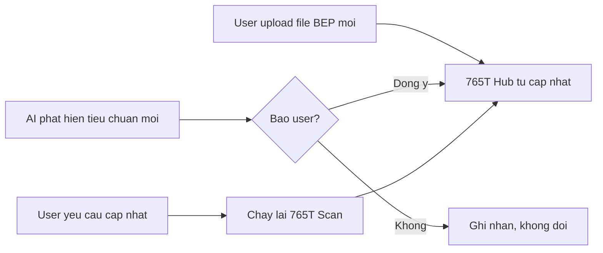
```mermaid
flowchart LR
    T1["User upload file BEP moi"] --> UPD["765T Hub tu cap nhat"]
    T2["AI phat hien tieu chuan moi"] --> ASK{"Bao user?"}
    T3["User yeu cau cap nhat"] --> RESCAN["Chay lai 765T Scan"]

    ASK -->|Dong y| UPD
    ASK -->|Khong| SKIP["Ghi nhan, khong doi"]
    RESCAN --> UPD
```

---

## 4. 765T Scan

> Quet doc quyen — KHONG phai chi dem warning.
> Muc tieu: AI HIEU du an, khong phai liet ke so lieu.

### 4a. Danh sach hang muc quet

| Hang muc | Chi tiet | Muc dich |
|---|---|---|
| **Project Info** | Ten, dia chi, phase, client | Dinh danh du an |
| **Levels** | Ten, cao do, so luong | Cau truc toa nha |
| **Views** | Ten, loai, Template, naming pattern | Phat hien tieu chuan dat ten |
| **Sheets** | Ten, so, Titleblock, layout | Tien do xuat ban |
| **View Templates** | Ten, cau hinh, usage count | Chuan do hoa |
| **Families/Types** | Ten, Category, naming pattern | Thu vien va chuan |
| **Links RVT** | Ten file, vi tri, Workset | Quan he discipline |
| **Links CAD** | Ten, layer, vi tri | CAD reference |
| **Worksets** | Ten, element count | To chuc team |
| **Parameters** | Shared/Project, naming | He thong du lieu |
| **Schedules** | Ten, Category, fields | Trich xuat du lieu |
| **Detail Components** | 2D families, drafting views | Chi tiet ban ve |
| **Dynamo Scripts** | File .dyn trong thu muc du an | Tool dang dung |
| **Add-ins** | Danh sach add-in load trong Revit | He sinh thai tool |

### 4b. 765T Compress Engine — Nen thong tin

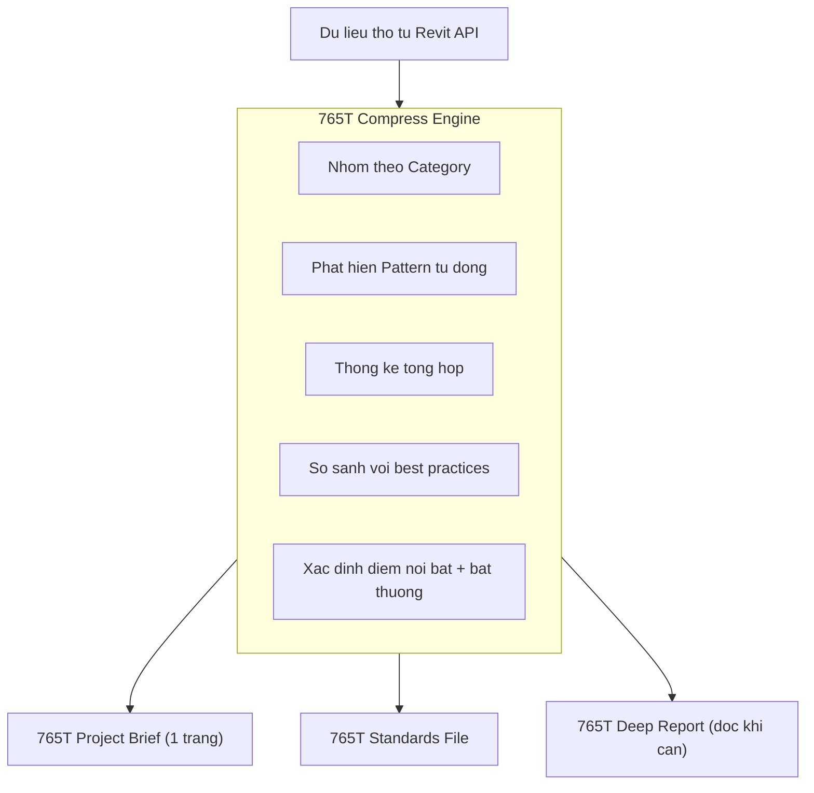
```mermaid
flowchart TD
    RAW["Du lieu tho tu Revit API"] --> COMPRESS

    subgraph COMPRESS ["765T Compress Engine"]
        C1["Nhom theo Category"]
        C2["Phat hien Pattern tu dong"]
        C3["Thong ke tong hop"]
        C4["So sanh voi best practices"]
        C5["Xac dinh diem noi bat + bat thuong"]
    end

    COMPRESS --> BRIEF["765T Project Brief (1 trang)"]
    COMPRESS --> STD["765T Standards File"]
    COMPRESS --> DEEP["765T Deep Report (doc khi can)"]
```

### 4c. Vi du 765T Project Brief

```
765T Project Brief - ProjectABC
================================

Em da hieu du an cua anh:

DU AN: Toa nha van phong 25 tang, 3 zone (A/B/C)
MANG: MEP - Co Dien Nuoc
PHASE: Design Development (DD)
TEAM: 8 Worksets -> uoc tinh 5-8 nguoi

CACH TO CHUC:
- View dat ten theo: [Disc]-[Level]-[Zone]-[System]
  (Tu phat hien tu 89% View hien co)
- 5 View Templates nhat quan
- Sheet numbering: [Disc][STT] (M01, M02...)
- Link 2 file Ket cau + 1 Kien truc (da pin)

DIEM NOI BAT:
- Dang o giua phase DD, con ~60% Sheet chua setup
- HVAC da model day du tang 1-15
- Tang 16-25 con trong (chua co MEP)
- Co 3 Dynamo script: auto-tag, export-schedule, renumber

DIEM CAN CHU Y:
- 34 View (15%) khong khop naming pattern
  -> Em co the tu dong sua neu anh muon
- 2 Link CAD chua pin -> co the bi xo lenh

Anh muon em tap trung vao mang nao truoc?
```

---

## 5. 765T Flow

> Lay cam hung tu Claude Code / DeepSeek.
> Nguoi dung thay AI suy nghi va lam viec — tao tin tuong.

### 5a. Sequence mau

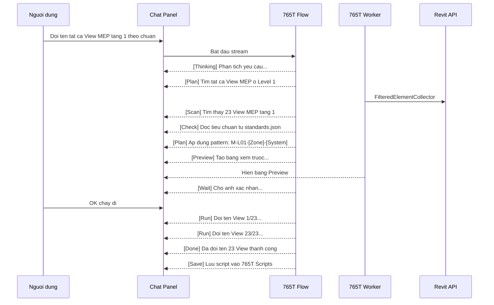
```mermaid
sequenceDiagram
    participant User as Nguoi dung
    participant UI as Chat Panel
    participant Flow as 765T Flow
    participant Agent as 765T Worker
    participant API as Revit API

    User->>UI: Doi ten tat ca View MEP tang 1 theo chuan
    UI->>Flow: Bat dau stream
    Flow-->>UI: [Thinking] Phan tich yeu cau...
    Flow-->>UI: [Plan] Tim tat ca View MEP o Level 1
    Agent->>API: FilteredElementCollector
    Flow-->>UI: [Scan] Tim thay 23 View MEP tang 1
    Flow-->>UI: [Check] Doc tieu chuan tu standards.json
    Flow-->>UI: [Plan] Ap dung pattern: M-L01-[Zone]-[System]
    Flow-->>UI: [Preview] Tao bang xem truoc...
    Agent-->>UI: Hien bang Preview
    Flow-->>UI: [Wait] Cho anh xac nhan...
    User->>UI: OK chay di
    Flow-->>UI: [Run] Doi ten View 1/23...
    Flow-->>UI: [Run] Doi ten View 23/23...
    Flow-->>UI: [Done] Da doi ten 23 View thanh cong
    Flow-->>UI: [Save] Luu script vao 765T Scripts
```

### 5b. Cac trang thai trong 765T Flow

| Tag | Trang thai | Y nghia |
|---|---|---|
| `[Thinking]` | Suy nghi | Dang phan tich yeu cau |
| `[Plan]` | Lap ke hoach | AI da hieu, dang len plan |
| `[Scan]` | Dang quet | Doc du lieu tu Revit |
| `[Check]` | Kiem tra | Doi chieu voi tieu chuan |
| `[Preview]` | Xem truoc | Ket qua du kien |
| `[Wait]` | Cho xac nhan | Can user phe duyet |
| `[Run]` | Thuc thi | Dang thay doi model |
| `[Done]` | Hoan thanh | Task xong |
| `[Error]` | Loi | Dang tu sua hoac bao loi |
| `[Save]` | Luu tru | Ghi log, cache script |

---

## 6. Vong lap hang ngay

### 6a. Kha nang truy cap cua 765T Worker

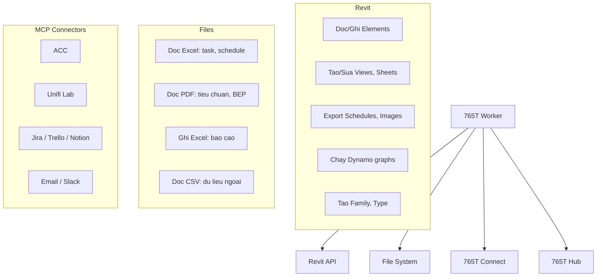
```mermaid
flowchart TD
    WORKER["765T Worker"] --> REVIT["Revit API"]
    WORKER --> FILES["File System"]
    WORKER --> CONNECT["765T Connect"]
    WORKER --> HUB["765T Hub"]

    subgraph R ["Revit"]
        RA1["Doc/Ghi Elements"]
        RA2["Tao/Sua Views, Sheets"]
        RA3["Export Schedules, Images"]
        RA4["Chay Dynamo graphs"]
        RA5["Tao Family, Type"]
    end

    subgraph F ["Files"]
        FA1["Doc Excel: task, schedule"]
        FA2["Doc PDF: tieu chuan, BEP"]
        FA3["Ghi Excel: bao cao"]
        FA4["Doc CSV: du lieu ngoai"]
    end

    subgraph M ["MCP Connectors"]
        MA1["ACC"]
        MA2["Unifi Lab"]
        MA3["Jira / Trello / Notion"]
        MA4["Email / Slack"]
    end
```

### 6b. Kich ban tich hop 765T Connect

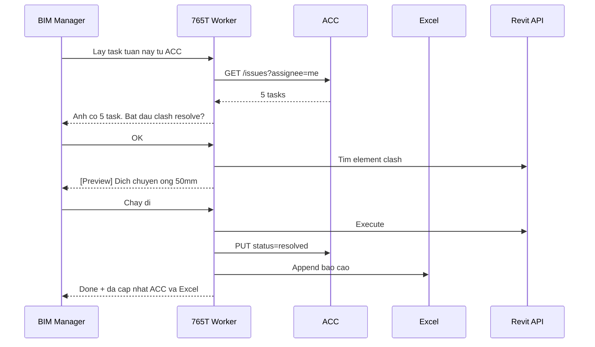
```mermaid
sequenceDiagram
    participant User as BIM Manager
    participant Worker as 765T Worker
    participant ACC as ACC
    participant Excel as Excel
    participant Revit as Revit API

    User->>Worker: Lay task tuan nay tu ACC
    Worker->>ACC: GET /issues?assignee=me
    ACC-->>Worker: 5 tasks
    Worker-->>User: Anh co 5 task. Bat dau clash resolve?
    User->>Worker: OK
    Worker->>Revit: Tim element clash
    Worker-->>User: [Preview] Dich chuyen ong 50mm
    User->>Worker: Chay di
    Worker->>Revit: Execute
    Worker->>ACC: PUT status=resolved
    Worker->>Excel: Append bao cao
    Worker-->>User: Done + da cap nhat ACC va Excel
```

### 6c. Mot ngay lam viec voi 765T

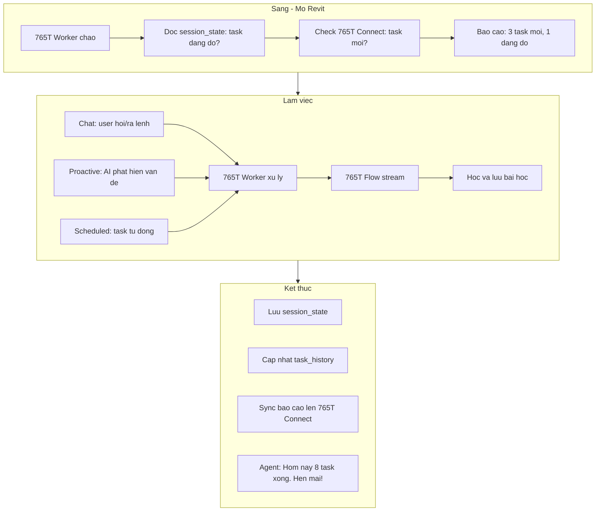
```mermaid
flowchart TD
    subgraph MORNING ["Sang - Mo Revit"]
        M1["765T Worker chao"]
        M2["Doc session_state: task dang do?"]
        M3["Check 765T Connect: task moi?"]
        M1 --> M2 --> M3
        M3 --> M4["Bao cao: 3 task moi, 1 dang do"]
    end

    subgraph WORKING ["Lam viec"]
        W1["Chat: user hoi/ra lenh"]
        W2["Proactive: AI phat hien van de"]
        W3["Scheduled: task tu dong"]
        W1 --> CORE["765T Worker xu ly"]
        W2 --> CORE
        W3 --> CORE
        CORE --> FLOW["765T Flow stream"]
        FLOW --> LEARN["Hoc va luu bai hoc"]
    end

    subgraph EVENING ["Ket thuc"]
        E1["Luu session_state"]
        E2["Cap nhat task_history"]
        E3["Sync bao cao len 765T Connect"]
        E4["Agent: Hom nay 8 task xong. Hen mai!"]
    end

    MORNING --> WORKING --> EVENING
```

---

## 7. 765T Connect

### 7a. Kien truc Connector

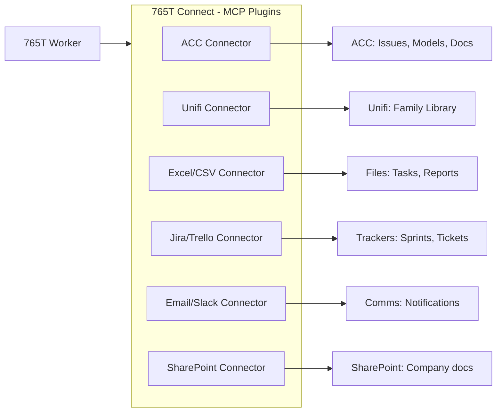
```mermaid
flowchart LR
    subgraph CON ["765T Connect - MCP Plugins"]
        C1["ACC Connector"]
        C2["Unifi Connector"]
        C3["Excel/CSV Connector"]
        C4["Jira/Trello Connector"]
        C5["Email/Slack Connector"]
        C6["SharePoint Connector"]
    end

    WORKER["765T Worker"] --> CON

    C1 --> ACC["ACC: Issues, Models, Docs"]
    C2 --> UNIFI["Unifi: Family Library"]
    C3 --> FILES["Files: Tasks, Reports"]
    C4 --> TASK["Trackers: Sprints, Tickets"]
    C5 --> COMM["Comms: Notifications"]
    C6 --> SP["SharePoint: Company docs"]
```

### 7b. Cau hinh Connector

> Nguoi dung cau hinh 1 lan trong 765T Hub:

```json
{
  "connectors": {
    "acc": {
      "enabled": true,
      "project_id": "abc-123",
      "token": "***encrypted***"
    },
    "excel_tasks": {
      "enabled": true,
      "path": "D:/Project/Tasks/weekly_tasks.xlsx",
      "sheet": "ThisWeek"
    },
    "jira": {
      "enabled": false
    }
  }
}
```

---

## 8. Drafter / BIMer

> *"Toi khong biet code. Toi chi muon noi va duoc lam."*

### 8a. Nhu cau thuc te va cach 765T giai quyet

| Nhu cau | 765T |
|---|---|
| Tim family nhanh | Hoi Worker -> tim trong model + Unifi |
| Copy view setup tang nay sang tang khac | Worker tao Views + ap dung Template + dat len Sheet |
| Dat ten dung chuan ma khong nho | 765T Suggest tu dong goi y khi tao moi |
| Xuat schedule ra Excel | Worker export truc tiep, format theo mau |
| Ve detail 2D nhanh | Worker goi y detail tuong tu trong model |
| Dung cau hinh cua nguoi khac | Worker doc standards.json team va ap dung |

### 8b. 765T Suggest — Goi y dung luc

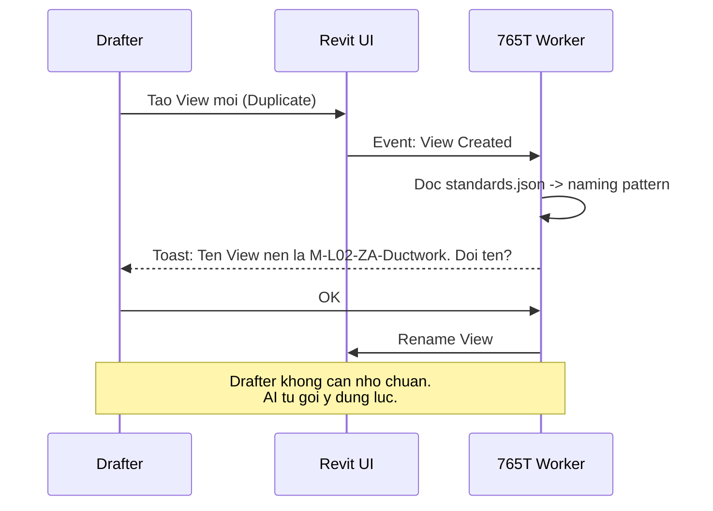
```mermaid
sequenceDiagram
    participant User as Drafter
    participant Revit as Revit UI
    participant Worker as 765T Worker

    User->>Revit: Tao View moi (Duplicate)
    Revit->>Worker: Event: View Created
    Worker->>Worker: Doc standards.json -> naming pattern
    Worker-->>User: Toast: Ten View nen la M-L02-ZA-Ductwork. Doi ten?
    User->>Worker: OK
    Worker->>Revit: Rename View
    Note over User, Worker: Drafter khong can nho chuan.<br/>AI tu goi y dung luc.
```

### 8c. Hoi dap thong tin (Chat and Learn)

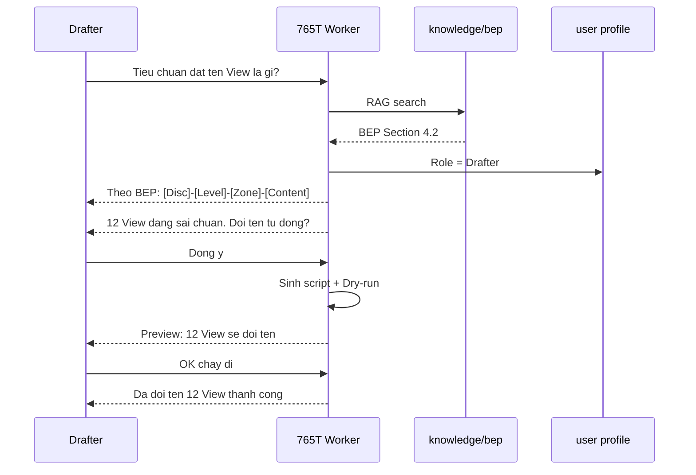
```mermaid
sequenceDiagram
    participant User as Drafter
    participant Agent as 765T Worker
    participant KB as knowledge/bep
    participant Prof as user profile

    User->>Agent: Tieu chuan dat ten View la gi?
    Agent->>KB: RAG search
    KB-->>Agent: BEP Section 4.2
    Agent->>Prof: Role = Drafter
    Agent-->>User: Theo BEP: [Disc]-[Level]-[Zone]-[Content]
    Agent-->>User: 12 View dang sai chuan. Doi ten tu dong?
    User->>Agent: Dong y
    Agent->>Agent: Sinh script + Dry-run
    Agent-->>User: Preview: 12 View se doi ten
    User->>Agent: OK chay di
    Agent-->>User: Da doi ten 12 View thanh cong
```

### 8d. Task truc tiep (Direct Task)

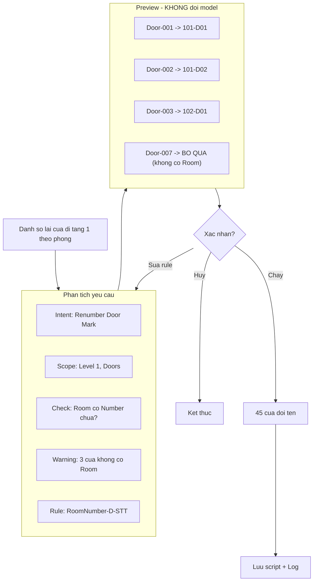
```mermaid
flowchart TD
    REQ["Danh so lai cua di tang 1 theo phong"] --> ANALYZE

    subgraph ANALYZE ["Phan tich yeu cau"]
        A1["Intent: Renumber Door Mark"]
        A2["Scope: Level 1, Doors"]
        A3["Check: Room co Number chua?"]
        A4["Warning: 3 cua khong co Room"]
        A5["Rule: RoomNumber-D-STT"]
    end

    ANALYZE --> PREVIEW

    subgraph PREVIEW ["Preview - KHONG doi model"]
        P1["Door-001 -> 101-D01"]
        P2["Door-002 -> 101-D02"]
        P3["Door-003 -> 102-D01"]
        P4["Door-007 -> BO QUA (khong co Room)"]
    end

    PREVIEW --> CONFIRM{"Xac nhan?"}
    CONFIRM -->|Chay| EXEC["45 cua doi ten"]
    CONFIRM -->|Huy| CANCEL["Ket thuc"]
    CONFIRM -->|Sua rule| ANALYZE

    EXEC --> SAVE["Luu script + Log"]
```

### 8e. Goi y chu dong (Proactive)

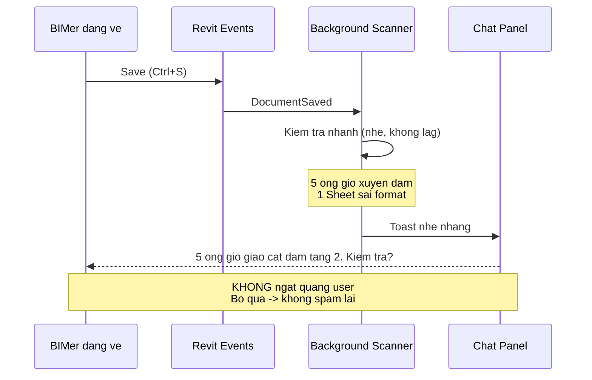
```mermaid
sequenceDiagram
    participant User as BIMer dang ve
    participant Revit as Revit Events
    participant Scan as Background Scanner
    participant UI as Chat Panel

    User->>Revit: Save (Ctrl+S)
    Revit->>Scan: DocumentSaved
    Scan->>Scan: Kiem tra nhanh (nhe, khong lag)
    Note over Scan: 5 ong gio xuyen dam<br/>1 Sheet sai format
    Scan->>UI: Toast nhe nhang
    UI-->>User: 5 ong gio giao cat dam tang 2. Kiem tra?
    Note over User, UI: KHONG ngat quang user<br/>Bo qua -> khong spam lai
```

### 8f. 765T Quick Actions

> Nut bam nhanh tren Chat Panel, tuy chinh theo role:

```
+------------------------------------+
|  765T Quick Actions                 |
|                                     |
|  [ Export Schedule ]  [ Tag All ]   |
|  [ Check Naming ]  [ Place Views ]  |
|  [ Copy to Sheet ]  [ Dim Auto ]    |
|                                     |
|  + Tuy chinh them...                |
+------------------------------------+
```

---

## 9. BIM Manager / Coordinator

> *"Toi can kiem soat chat luong ma khong can mo tung View."*

### 9a. 765T Audit — Multi-agent quet song song

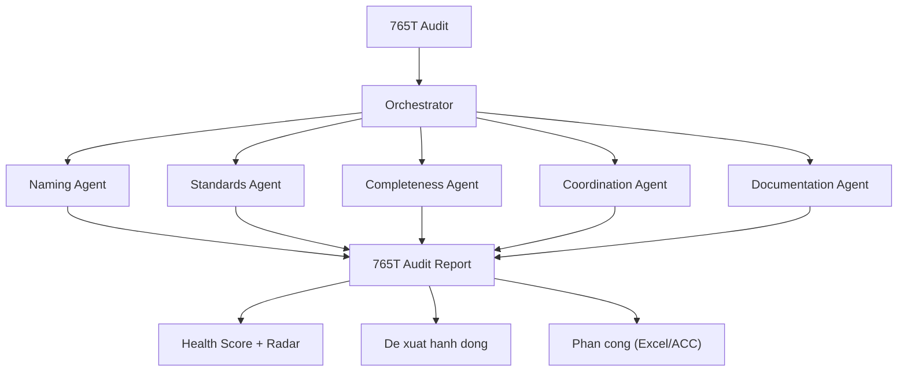
```mermaid
flowchart TD
    CMD["765T Audit"] --> ORCH["Orchestrator"]

    ORCH --> A1["Naming Agent"]
    ORCH --> A2["Standards Agent"]
    ORCH --> A3["Completeness Agent"]
    ORCH --> A4["Coordination Agent"]
    ORCH --> A5["Documentation Agent"]

    A1 --> REPORT["765T Audit Report"]
    A2 --> REPORT
    A3 --> REPORT
    A4 --> REPORT
    A5 --> REPORT

    REPORT --> SCORE["Health Score + Radar"]
    REPORT --> ACTION["De xuat hanh dong"]
    REPORT --> DELEGATE["Phan cong (Excel/ACC)"]
```

### 9b. 765T Audit Report — Bao cao thong minh

> Output la 1 bao cao ma Manager doc 30 giay la hieu.
> KHONG phai bang so lieu kho hieu.

```
765T Audit Report - ProjectABC - 2026-03-22
=============================================

TONG QUAN: 74/100 diem. Tang 6 diem so voi tuan truoc.

DIEM MANH:
[ok] Naming: 92% Views dung chuan (tang tu 85%)
[ok] View Templates: Nhat quan toan du an
[ok] Sheet setup: 65% hoan thanh (dung tien do DD)

CAN XU LY:
[!] 8 clash MEP-STR o tang 12-15
[!] 12 View chua co tren Sheet (View tam?)
[!] Family "Generic_Duct_Fitting" dung ban cu

DE XUAT:
1. [Auto-fix] 19 View sai ten -> Worker sua? [Chay]
2. [Assign] 8 clash -> Giao BIMer_B qua ACC? [Giao]
3. [Review] 12 View mo coi -> Xem danh sach? [Xem]

THAY DOI SO VOI TUAN TRUOC:
+ 89 elements moi (MEP tang 14-15)
- 3 Views bi xoa
~ 12 Sheets cap nhat
```

### 9c. So sanh Delta model

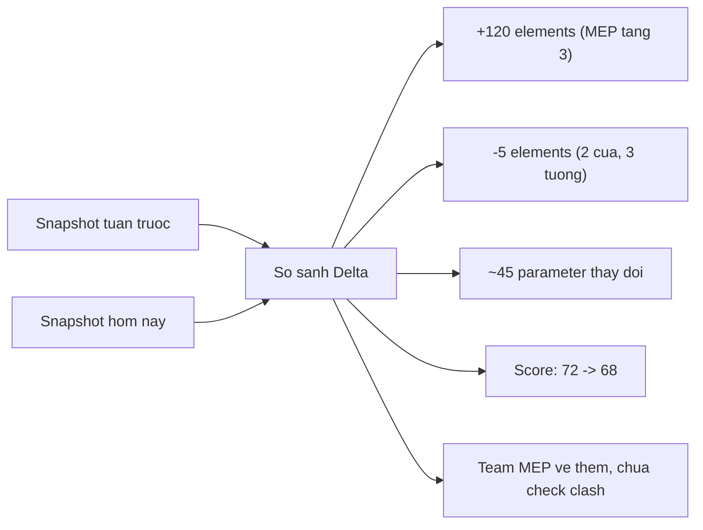
```mermaid
flowchart LR
    OLD["Snapshot tuan truoc"] --> DIFF["So sanh Delta"]
    NEW["Snapshot hom nay"] --> DIFF

    DIFF --> D1["+120 elements (MEP tang 3)"]
    DIFF --> D2["-5 elements (2 cua, 3 tuong)"]
    DIFF --> D3["~45 parameter thay doi"]
    DIFF --> D4["Score: 72 -> 68"]
    DIFF --> ROOT["Team MEP ve them, chua check clash"]
```

### 9d. Phan cong sua loi

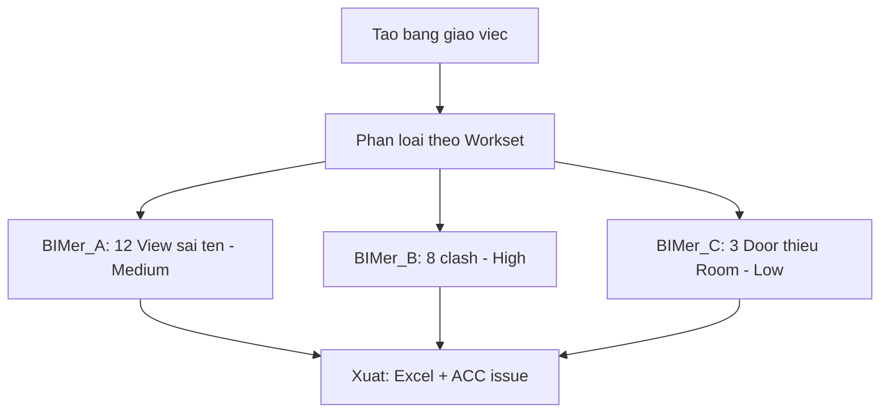
```mermaid
flowchart TD
    CMD2["Tao bang giao viec"] --> CLASSIFY["Phan loai theo Workset"]

    CLASSIFY --> T1["BIMer_A: 12 View sai ten - Medium"]
    CLASSIFY --> T2["BIMer_B: 8 clash - High"]
    CLASSIFY --> T3["BIMer_C: 3 Door thieu Room - Low"]

    T1 --> OUT["Xuat: Excel + ACC issue"]
    T2 --> OUT
    T3 --> OUT
```

### 9e. Trend theo thoi gian

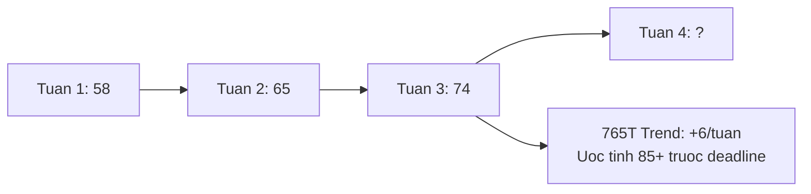
```mermaid
flowchart LR
    W1["Tuan 1: 58"] --> W2["Tuan 2: 65"]
    W2 --> W3["Tuan 3: 74"]
    W3 --> W4["Tuan 4: ?"]
    W3 --> TREND["765T Trend: +6/tuan\nUoc tinh 85+ truoc deadline"]
```

---

## 10. Pro Developer

> *"Toi muon mo rong he thong va dong gop tool."*

### 10a. 765T Plugin SDK

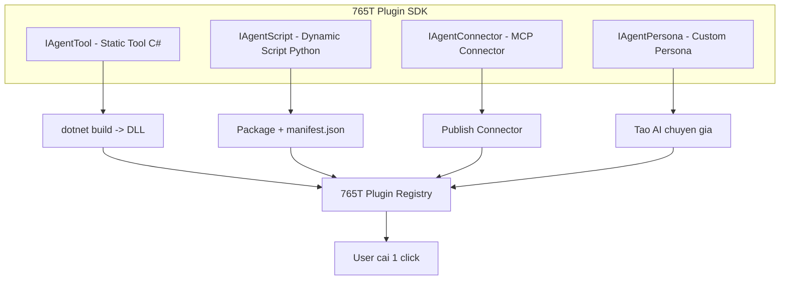
```mermaid
flowchart TD
    subgraph SDK ["765T Plugin SDK"]
        I1["IAgentTool - Static Tool C#"]
        I2["IAgentScript - Dynamic Script Python"]
        I3["IAgentConnector - MCP Connector"]
        I4["IAgentPersona - Custom Persona"]
    end

    I1 --> BUILD["dotnet build -> DLL"]
    I2 --> PACK["Package + manifest.json"]
    I3 --> CONN["Publish Connector"]
    I4 --> PERS["Tao AI chuyen gia"]

    BUILD --> REG["765T Plugin Registry"]
    PACK --> REG
    CONN --> REG
    PERS --> REG

    REG --> USERS["User cai 1 click"]
```

### 10b. Vi du Custom Tool

```csharp
public class MyClashTool : IAgentTool
{
    public string Name => "765t.custom.clash_detector";
    public string Description => "Phat hien va cham MEP-STR";
    public string[] Tags => new[] { "clash", "mep", "coordination" };
    public RiskLevel Risk => RiskLevel.ReadOnly;

    public ToolResult Execute(ToolPayload payload, RevitContext ctx)
    {
        // Logic phat hien clash...
        return new ToolResult
        {
            Success = true,
            Data = clashReport,
            Summary = $"Tim thay {count} clash"
        };
    }
}
```

### 10c. Vi du Custom Persona

```json
{
  "name": "765T MEP Specialist",
  "description": "Chuyen gia MEP 15 nam",
  "system_prompt": "Ban la chuyen gia MEP...",
  "preferred_tools": ["765t.scan", "765t.audit.mep"],
  "knowledge_sources": ["company_mep_standards/"],
  "style": {
    "language": "vi",
    "detail_level": "medium",
    "proactive": true
  }
}
```

### 10d. Flow dong gop

```mermaid
flowchart LR
    A["Clone repo"] --> B["dotnet build"]
    B --> C["dotnet test"]
    C --> D["Viet Tool/Script"]
    D --> E["Test"]
    E --> F["PR Review"]
    F --> G["Merge"]
    G --> H["Auto-publish Registry"]
```

---

## 11. Kien truc ky thuat

### 11a. 5 lop (Layers)

```mermaid
flowchart TD
    subgraph L1 ["LAYER 1: PRESENTATION"]
        P1["Revit Panel - WPF + WebView2"]
        P2["765T Flow Stream"]
        P3["Web Dashboard - React"]
    end

    subgraph L2 ["LAYER 2: INTELLIGENCE"]
        G1["LLM Router"]
        G2["765T Persona"]
        G3["765T Compress"]
    end

    subgraph L3 ["LAYER 3: ORCHESTRATION"]
        O1["Task Queue"]
        O2["Agent Orchestrator"]
        O3["Context Manager + RAG"]
    end

    subgraph L4 ["LAYER 4: EXECUTION"]
        E1["Safety Gate"]
        E2["Static Tools C#"]
        E3["Dynamic Engine Python/Dynamo"]
        E4["Plugin Loader"]
        E5["Revit API Wrapper"]
    end

    subgraph L5 ["LAYER 5: PERSISTENCE"]
        D1["765T Hub"]
        D2["SQLite Event Store"]
        D3["Vector Store"]
        D4["765T Connect"]
    end

    L1 --> L2 --> L3 --> L4 --> L5
```

### 11b. Xu ly 1 request chi tiet

```mermaid
sequenceDiagram
    participant UI as Chat UI
    participant Flow as 765T Flow
    participant Router as LLM Router
    participant Persona as Persona
    participant LLM as LLM
    participant Hub as 765T Hub
    participant Worker as Orchestrator
    participant Gate as Safety Gate
    participant Exec as Executor
    participant API as Revit API
    participant Con as 765T Connect

    UI->>Flow: User prompt
    Flow-->>UI: [Thinking]
    Flow->>Router: Phan loai intent
    Router->>Hub: Doc context
    Hub-->>Router: brief + standards + session
    Router->>Persona: Lay style
    Router->>LLM: Prompt + context + persona
    Flow-->>UI: [Plan]
    LLM-->>Router: Response + tool calls
    Router->>Worker: Tasks
    Worker->>Gate: Validate
    Flow-->>UI: [Check]
    Gate->>Exec: OK
    Exec->>API: Dry-run
    Flow-->>UI: [Preview]
    UI->>Worker: Approve
    Flow-->>UI: [Run]
    Exec->>API: Execute
    Flow-->>UI: [Done]
    Exec->>Hub: Log + cache
    Exec->>Con: Update ACC/Excel
    Flow-->>UI: [Save]
```

---

## 12. LLM Router

### 12a. Phan loai va dinh tuyen

```mermaid
flowchart TD
    INPUT["User Prompt"] --> CLS{"765T Intent Classifier"}

    CLS -->|Chao hoi| CACHE["CACHE - $0"]
    CLS -->|Hoi kien thuc| FLASH["GEMINI FLASH + RAG - $"]
    CLS -->|Task don gian| FLASH2["GEMINI FLASH + Tool - $"]
    CLS -->|Viet code| SONNET["CLAUDE SONNET - $$$"]
    CLS -->|Audit/Macro| MULTI["MULTI-AGENT - $$"]

    CACHE --> OUT["Response"]
    FLASH --> OUT
    FLASH2 --> OUT
    SONNET --> OUT
    MULTI --> OUT
```

### 12b. 765T Scripts Cache — Chi phi giam ve 0

```mermaid
sequenceDiagram
    participant User
    participant Router
    participant Sonnet as Claude Sonnet
    participant Cache as 765T Scripts

    Note over User,Cache: LAN 1 - Moi hoan toan
    User->>Router: Danh so cua theo phong
    Router->>Sonnet: Sinh code
    Sonnet-->>Router: renumber_doors.py
    Router->>Cache: Luu verified
    Router-->>User: Done - $0.15

    Note over User,Cache: LAN 2 - Giong het
    User->>Router: Danh so cua tang khac
    Router->>Cache: Match 100%
    Router-->>User: Chay script cu - $0.00

    Note over User,Cache: LAN 3 - Tuong tu
    User->>Router: Danh so cua them tien to
    Router->>Cache: Match 80%
    Router->>Router: Flash tinh chinh
    Router-->>User: Done - $0.02
```

### 12c. Uoc tinh chi phi

| Loai | Ty le | Model | Cost / 1000 req |
|---|---|---|---|
| Simple Chat | 30% | Cache | $0 |
| Knowledge | 35% | Gemini Flash | ~$0.02 |
| Direct Task | 20% | Flash + Tool | ~$0.03 |
| Code Gen | 10% | Claude Sonnet | ~$0.15 |
| Macro | 5% | Multi-agent | ~$0.08 |
| **Average** | | | **~$0.03** |

> So voi goi Claude cho tat ca: ~$0.12 → **Tiet kiem ~75%.**
> Cang dung nhieu → Cache day → chi phi giam ve $0.

---

## 13. So sanh thi truong

| Tinh nang | pyRevit | OpenClaw | AI Web | **765T** |
|---|---|---|---|---|
| In-Revit | Yes | Yes | No | **Yes** |
| Chat AI | No | Yes | Yes (web) | **Yes (in-Revit)** |
| Stream activity | No | No | No | **765T Flow** |
| Dynamic code gen | No | No | No | **Yes** |
| Project context | No | Basic | No | **765T Scan** |
| Remember habits | No | No | No | **765T Hub** |
| Auto-cache scripts | Manual | No | No | **765T Scripts** |
| Background QC | No | No | No | **Event-driven** |
| Multi-agent audit | No | No | No | **765T Audit** |
| External connectors | No | No | No | **765T Connect** |
| Plugin ecosystem | Yes | No | No | **765T SDK** |
| Delta compare | No | No | No | **Yes** |
| Safe dry-run | No | No | No | **Yes** |
| Cost optimized | N/A | $$ | $$$ | **$ (Router)** |
| AI Personality | No | No | No | **765T Persona** |

---

## 14. Product Checklist

### Core Features
- [ ] **765T Onboarding**: Welcome popup, tu dong quet, khong can config
- [ ] **765T Flow**: Stream realtime moi hanh dong
- [ ] **765T Scan**: Quet doc quyen, nen thong tin, Project Brief
- [ ] **765T Hub**: `%APPDATA%\BIM765T.Revit.Agent\workspaces\` voi cau truc chuan
- [ ] **765T Persona**: Tinh cach AI tuy chinh
- [ ] **765T Connect**: MCP connectors (ACC, Unifi, Excel, Jira)
- [ ] **765T Scripts**: Auto-cache + tai su dung + marketplace
- [ ] **765T Audit**: Multi-agent + Health Score + trend
- [ ] **765T Suggest**: Goi y dung luc khi user thao tac
- [ ] **765T Quick Actions**: Nut bam nhanh theo role

### Safety & Reliability
- [ ] **Dry-run / Preview**: Moi mutation phai co preview truoc
- [ ] **Undo/Rollback**: Hoan tac 1 click
- [ ] **Central model safe**: Khong tu sync-to-central
- [ ] **Performance guard**: Khong quet khi Revit nang
- [ ] **Error recovery**: Script loi -> tu sua -> chay lai (max 3)
- [ ] **Audit trail**: Log Element ID + timestamp moi thay doi

### User Experience
- [ ] **Feedback loop**: Thumbs up/down -> Agent cai thien
- [ ] **Session handoff**: Dong Revit mo lai -> nho task dang do
- [ ] **Template prompts**: Prompt mau theo role
- [ ] **Multi-language**: Tieng Viet + English
- [ ] **Multi-Revit-version**: 2023 / 2024 / 2025 tu dong

### Business
- [ ] **Offline fallback**: Lenh co ban chay khi mat mang
- [ ] **Quota control**: Gioi han token/ngay cho free plan
- [ ] **Telemetry opt-in**: Anonymous usage analytics
- [ ] **Script marketplace**: Cong dong chia se script

---

> **765T Agentic BIM OS** — Day la tai lieu song (living document).
> Cap nhat khi co quyet dinh thiet ke moi hoac phan hoi tu user.
