# 765T Blueprint - Critical Technical Review

> **Date:** 2026-03-22
> **Purpose:** Phan tich phan bien (Devil's Advocate) cho 765T Blueprint
> tu goc nhin ky thuat cao cap, thuc te, khong ao tuong.
>
> Tai lieu nay KHONG phai de chon, ma de lam cho Blueprint manh hon.

---

## MUC LUC

1. [Tong diem: Dang o dau tren thang do truong thanh?](#1-tong-diem)
2. [5 van de KY THUAT nghiem trong nhat](#2-van-de-ky-thuat)
3. [5 diem AO TUONG can loai bo](#3-ao-tuong)
4. [5 diem THUC SU TOT can giu lai](#4-diem-tot)
5. [Revit API - Su that phu phang](#5-revit-api-su-that)
6. [LLM Router - Phan tich thuc te](#6-llm-router-thuc-te)
7. [Kinh doanh - Nhung cau hoi chua tra loi](#7-kinh-doanh)
8. [De xuat: Blueprint V2 nen nhu the nao](#8-de-xuat-v2)
9. [Roadmap thuc te (khong ao)](#9-roadmap)

---

## 1. Tong diem

### Thang do truong thanh (Maturity Scale)

```
Tam nhin (Vision):      ████████████████████░  9/10  Xuat sac
Kien truc (Design):     ████████████░░░░░░░░░  6/10  Kha nhung nhieu lo hong
Kha thi (Feasibility):  ████████░░░░░░░░░░░░░  4/10  Nhieu phan chua kha thi
Hien thuc (Built):      ███░░░░░░░░░░░░░░░░░░  1.5/10  Moi co Bridge + Contracts
```

**Nhan dinh tong the:**
Blueprint hien tai la mot **Product Vision Document** tot, nhung dang bi
NHAM voi mot **Technical Architecture Document**. Hai thu nay khac nhau:

- Vision Document: "Chung ta MUON lam gi" → 765T Blueprint dang o day
- Architecture Document: "Chung ta se lam BANG CACH NAO, voi RANG BUOC gi" → THIEU

Van de lon nhat: Blueprint ve ra 10 thanh phan (Worker, Scan, Hub, Flow,
Connect, Audit, Scripts, Persona, Suggest, Quick Actions) nhung KHONG co
bat ky phan tich nao ve:
- Thu tu xay dung (dependency graph)
- Rang buoc ky thuat cua tung thanh phan
- Thoi gian uoc tinh thuc te
- Risk va fallback plan

---

## 2. Van de KY THUAT nghiem trong nhat

### 2a. Revit API la SINGLE-THREADED

**Van de:**
Blueprint noi "Multi-agent quet song song" cho 765T Audit
(Naming Agent, Clash Agent, Standards Agent... chay parallel).

**Su that:**
Revit API chi chay duoc tren UI thread. Moi lenh goi toi
`FilteredElementCollector`, doc parameter, hay bat ky API call nao
DEU PHAI chay tren main thread qua `ExternalEvent` hoac `IExternalEventHandler`.

Khong the chay 5 agent song song doc Revit data.

**He qua:**
- "Multi-agent parallel scan" la AO TUONG ve mat ky thuat
- Tren thuc te, cac agent phai CHIA LUOT doc data tu Revit
- Hoac: 1 agent doc TAT CA data 1 lan, serialize ra JSON,
  roi cac agent khac xu ly JSON do NGOAI Revit (trong WorkerHost)

**Giai phap thuc te:**
```
Revit (UI Thread)              WorkerHost (.NET 8)
      |                              |
      |--- Scan ALL data (1 lan) --> |
      |    (serialize to JSON)       |
      |                              |--- Naming Agent (parallel) --|
      |                              |--- Standards Agent (parallel)|-- Aggregate
      |                              |--- Completeness Agent -------|
      |                              |
      |<-- Ket qua tong hop ---------|
```

Dieu nay co nghia 765T Scan PHAI duoc thiet ke de:
1. Doc toan bo data CAN THIET trong 1 luot (tren UI thread)
2. Serialize thanh JSON/protobuf
3. Gui qua pipe cho WorkerHost
4. WorkerHost moi la noi chay multi-agent

→ Blueprint can bo sung "Data Extraction Layer" giua Revit va Agents.


### 2b. Dynamic Code Execution — Rui ro bao mat cuc ky lon

**Van de:**
Blueprint de xuat AI sinh code Python/C# roi chay truc tiep trong Revit.

**Su that:**
- IronPython da CHET (last release 2022, khong ho tro Python 3 day du)
- CPython embedding trong .NET Framework 4.8 rat kho (pythonnet co nhieu bug)
- Cho phep AI sinh code roi EXECUTE trong Revit = cho phep
  XOA TOAN BO MODEL neu AI sinh code sai
- Autodesk co the TU CHOI add-in neu phat hien execute arbitrary code
- Khong co sandbox an toan cho Revit API

**He qua:**
- Day la tinh nang HUT KHACH nhat nhung cung NGUY HIEM nhat
- 1 bug trong AI-generated code co the huy hoai du an tri gia hang ty

**Giai phap thuc te:**
KHONG cho AI execute arbitrary code truc tiep.
Thay vao do, dung mo hinh "Controlled Tool Expansion":

```
Cap 1: Pre-built Tools (AN TOAN)
  - Cac tool C# da duoc compile va test
  - AI chi GOI tool, khong VIET code
  - VD: tool.rename_views(pattern="M-{Level}-{Zone}-{System}")

Cap 2: Parameterized Templates (AN TOAN VUA)
  - Cac script template voi placeholder
  - AI chi DIEN tham so, khong viet logic
  - VD: template "renumber_by_room" voi param {category, pattern, level}

Cap 3: Reviewed Scripts (AN TOAN CO DIEU KIEN)
  - AI sinh code → HIEN THI cho user doc → user CHAP NHAN → moi chay
  - Code phai qua static analysis truoc khi execute
  - KHONG cho phep: delete, purge, sync-to-central, close document
  - Co sandbox: rollback Transaction neu co exception

Cap 4: Dynamic Execution (CHI CHO PRO DEV, OPT-IN)
  - Chi bat khi user la developer va hieu rui ro
  - Phai ky xac nhan rieng
  - Moi phien chi chay trong Transaction co the rollback
```

→ Blueprint hien tai nhay thang toi Cap 4 ma khong co Cap 1-3.
  Day la sai lam nghiem trong.


### 2c. LLM Router — Oversimplified

**Van de:**
Blueprint noi Intent Classifier dung "local rule-based" de phan loai
prompt thanh 5 loai (Simple Chat, Knowledge, Task, Code Gen, Macro).

**Su that:**
- Rule-based intent classification chi dung cho ~30% cac cau hoi
- Nguoi dung BIM khong noi theo pattern co dinh
- VD: "Ong nay sao no chui qua dam vay?" → La clash detection?
  Knowledge chat? Hay yeu cau fix?
- Phan loai sai = gui prompt dat tien sang model re = ket qua te
  HOAC gui prompt re sang model dat = ton tien vo ich

**He qua:**
- Cost model $0.03/interaction la QUA LAC QUAN
- Thuc te se la $0.06-0.08 vi misrouting

**Giai phap thuc te:**
- Dung 1 model NHE (nhu Gemini Flash) lam classifier cho TAT CA prompt
  Chi phi classifier: ~$0.001/prompt (re)
- Dua vao ket qua classifier moi route sang model phu hop
- Hoac don gian hon: CHI DUNG 1 MODEL cho moi thu (Gemini Flash)
  va chi goi model dat khi task THAT SU can code generation
- Thuc te, Gemini 2.0 Flash da du manh cho 90% tac vu BIM


### 2d. Vector DB — Overkill cho use-case nay

**Van de:**
Blueprint dung Qdrant/Chroma cho semantic search BEP/standards.

**Su that:**
- File BEP trung binh: 20-50 trang PDF
- Tieu chuan cong ty: 5-20 trang
- Tong luong text: ~50,000 - 200,000 tokens
- Gemini Flash co context window 1M tokens
- Gemini 2.5 Pro co 1M tokens

**He qua:**
- Khong can Vector DB. Chi can NHE NGUYEN FILE TEXT vao context window
- Vector DB them do phuc tap (cai dat, maintain, debug) ma khong them gia tri
- RAG chunking co the MAT CONTEXT (cat doan giua cau)

**Giai phap thuc te:**
```
Phase 1 (MVP): Nhét nguyen file text vao prompt
  - BEP 50 trang ≈ 25,000 tokens ≈ $0.001 voi Gemini Flash
  - KHONG CAN infrastructure phuc tap

Phase 2 (Scale): Chi dung Vector DB khi:
  - Tong tai lieu > 500,000 tokens (qua lon cho context window)
  - Hoac can search across NHIEU du an cung luc
  - Luc do dung SQLite FTS5 truoc (da co san, khong can cai them)
  - Chi dung Qdrant/Chroma khi FTS5 khong du semantic understanding
```


### 2e. .NET Framework 4.8 vs .NET 8 — The Elephant in the Room

**Van de:**
Revit 2024 dung .NET Framework 4.8. WorkerHost dung .NET 8.
Giao tiep qua Named Pipes.

**Su that:**
- SERIALIZATION la bottleneck: moi request/response phai serialize
  qua pipe, ma BIM data co the rat lon (10,000+ elements)
- 2 he thong type khac nhau (.NET FW vs .NET Core)
- Debug cross-process rat kho
- Revit 2025+ da chuyen sang .NET 8 → ca stack co the unify

**He qua:**
- Neu chi target Revit 2025+: co the bo Named Pipes, chay trong process
- Neu target Revit 2024: phai chap nhan overhead cua cross-process

**Giai phap thuc te:**
- TARGET REVIT 2025+ cho san pham moi. Revit 2024 la legacy.
- Dieu nay don gian hoa TOAN BO kien truc:
  - Khong can WorkerHost rieng
  - Khong can Named Pipes
  - Khong can 2 solution khac nhau
  - Agent, LLM Router, va Tool Executor chay TRONG CUNG PROCESS

---

## 3. Ao tuong can loai bo

### 3a. "AI thay the Pro BIM"
- AI KHONG thay the duoc BIM Coordinator/Manager
- AI la TOOL giup ho lam NHANH hon, it SAI hon
- Dung marketing kieu "thay the con nguoi" → phan cam
- Nen la: "765T giup ban lam trong 5 phut viec truoc mat 2 gio"

### 3b. "Script Marketplace nhu npm"
- BIM community nho hon developer community 100 lan
- Khong du nguoi dong gop de tao marketplace song dong
- Nen tap trung vao: CUNG CAP SCRIPT TOT, khong phai xay marketplace
- Phase 1: 765T team viet 50 script core cho cac task pho bien nhat
- Phase 2 (neu co cong dong): moi mo marketplace

### 3c. "MCP Connect toi moi thu"
- Moi connector can OAuth, API key, maintenance rieng
- ACC API thay doi lien tuc, Unifi API han che
- Moi connector la 1 san pham nho rieng
- Phase 1: Chi lam EXCEL connector (90% BIM workflow dung Excel)
- Phase 2: ACC (neu co demand thuc te tu user)
- Phase 3+: Cac he thong khac

### 3d. "Custom Persona tuy chinh AI"
- User thuong khong biet cau hinh AI
- "Persona" nghe hay nhung thuc te chi la system prompt
- Chi can 3 preset: Drafter Mode, Manager Mode, Expert Mode
- Khong can cho user viet system prompt rieng (qua phuc tap)

### 3e. "Health Score 72/100"
- Khong co tieu chuan nganh nao dinh nghia "Model Health Score"
- Tu dat diem → tu danh gia → khong co gia tri khach quan
- Nen thay bang: Checklist cu the co/khong (nhu BIM Collaboration Format)
- VD: "34/40 hang muc naming dung chuan" co gia tri hon "Score 85%"

---

## 4. Diem THUC SU TOT can giu lai

### 4a. 765T Hub (%APPDATA%\BIM765T.Revit.Agent\workspaces\)
- Dung: de o user folder, khong de canh file Revit
- Cau truc project-based (theo hash) la dung
- Thu tu uu tien doc file (Luon doc / Doc khi can / Doc khi yeu cau) la TUYET VOI
- Day la competitive advantage thuc su so voi OpenClaw

### 4b. 765T Flow (Streaming UX)
- Hien thi AI dang lam gi la DIEM KHAC BIET SO 1
- Khong ai trong BIM space dang lam dieu nay
- TAP TRUNG lam tot tinh nang nay truoc
- No tao TRUST — dieu quan trong nhat khi AI thao tac model cua ban

### 4c. Safe Mutation (Dry-run → Approve → Execute)
- Day la nen tang AN TOAN tot nhat trong industry
- Giu nguyen, khong cat giam
- Them: auto-snapshot truoc moi mutation (Revit co API tao backup)

### 4d. Project Brief thay vi Statistics
- Y tuong "AI tom tat nhu nguoi hieu du an" la DUNG
- Khong ai quan tam "2847 warnings" — dung
- Nhung phai chac chan Brief la CHINH XAC, khong bi hallucination
- Giai phap: Brief chi bao cao nhung gi 765T Scan DA THUC SU DOC
  Khong de LLM suy doan them thong tin khong co trong data

### 4e. Script Caching
- Y tuong co gia tri thuc te
- Nhung can hieu: cache = cache TOOL CALLS, khong phai cache RAW CODE
- VD: "renumber_doors(level=1, pattern='{room}-D{seq}')" la cacheable
- Khong phai cache file .py vi code context-dependent

---

## 5. Revit API — Su that phu phang

### 5a. Nhung gi Revit API LAM DUOC tot

| Kha nang | Do kho | Ghi chu |
|---|---|---|
| Doc tat ca Elements, Parameters | De | FilteredElementCollector |
| Doc Views, Sheets, Families | De | Standard API |
| Doi ten, doi parameter | De | Transaction required |
| Tao View, dat len Sheet | Trung binh | Can hieu ViewType, Titleblock |
| Export Schedule ra CSV/text | De | ViewSchedule.Export() |
| Tao Family programmatically | KHO | FamilyCreate API phuc tap |
| Clash detection | RAT KHO | Phai tu code, khong co API san |
| Chay Dynamo graph tu API | KHO | DynamoRevit API han che |
| Background scanning | HAN CHE | IdlingEvent rat gioi han |
| Undo/Redo tu code | KHONG THE | Revit khong co Undo API |

### 5b. Nhung gi KHONG KHA THI

1. **Parallel Revit API calls** → KHONG (single-threaded)
2. **Real-time clash detection** → KHONG (qua cham, dung Navisworks)
3. **Undo 1 click** → KHONG (phai dung Transaction Groups phuc tap)
4. **Chay Dynamo graph on-the-fly** → RAT KHO (API khong stable)
5. **Doc Add-in list tu API** → HAN CHE (khong co public API day du)
6. **Background QC khi user dang ve** → RAT HAN CHE
   (IdlingEvent chi chay khi Revit RANH, va co time limit)

### 5c. Giai phap cho "Undo/Rollback"

Blueprint hua "Undo 1 click" nhung Revit khong co Undo API.

**Giai phap thuc te:**
```
Option A: Transaction Group
  - Bat dau TransactionGroup truoc khi AI lam bat ky gi
  - Neu user khong hai long → RollBack() TransactionGroup
  - Han che: chi undo TOAN BO nhom, khong undo tung buoc

Option B: Snapshot + Compare
  - Truoc khi mutation: luu trang thai cac element bi anh huong
  - Sau mutation: neu user muon undo → dat lai parameter cu
  - Han che: chi hoat dong cho parameter changes, khong cho delete/create

Option C (khuyen nghi): Detached Copy
  - Tao 1 ban sao detached truoc khi lam
  - Neu sai: quay lai ban sao
  - Don gian, an toan, nhung ton dung luong
```

---

## 6. LLM Router — Phan tich thuc te

### 6a. Cost model thuc te (khong lac quan)

| Kich ban | Blueprint estimate | Thuc te estimate | Ly do |
|---|---|---|---|
| Simple Chat | $0 (cache) | $0.001 | Van can LLM format response |
| Knowledge | $0.02 | $0.01-0.03 | Phu thuoc do dai context |
| Direct Task | $0.03 | $0.02-0.05 | Can doc model data + reason |
| Code Gen | $0.15 | $0.05-0.20 | Phu thuoc do phuc tap |
| Macro | $0.08 | $0.10-0.30 | Nhieu buoc, nhieu API call |
| **Average** | **$0.03** | **$0.04-0.08** | |

→ Thuc te dat hon ~2x so voi estimate. Van RE hon goi Claude cho tat ca,
  nhung khong re nhu Blueprint noi.

### 6b. Khuyen nghi LLM strategy

```
Phase 1 (MVP): CHI DUNG 1 MODEL
  - Gemini 2.0 Flash cho TAT CA
  - Khong can router (giam do phuc tap)
  - Chi phi: ~$0.02-0.04/interaction
  - Tap trung vao CHAT + DOC DATA + GOI TOOL

Phase 2 (khi co revenue):
  - Them model manh hon cho code gen (Claude/GPT)
  - Luc nay moi can router
  - Co data thuc te de train classifier

Phase 3 (khi co scale):
  - Fine-tune model nhe cho BIM domain
  - Hoac dung local model (Llama/Qwen) cho privacy
```

---

## 7. Kinh doanh — Nhung cau hoi chua tra loi

Blueprint KHONG de cap bat ky dieu nao sau day:

### 7a. Target customer la AI?
- Ca nhan dung Revit tai nha? (thay PyRevit)
- Team nho 5-10 nguoi? (thay manual QC)
- Cong ty lon 100+ nguoi? (can enterprise features)
- Moi nhom can feature KHAC NHAU va pricing KHAC NHAU

### 7b. Pricing model?
- Freemium + paid tier? (nhu Cursor)
- Per-seat license? (nhu Revit)
- Usage-based? (nhu OpenAI API)
- BYOK (Bring Your Own Key)? → Re nhat cho startup

### 7c. Moat (loi the canh tranh ben vung)?
- OpenClaw co the copy 765T Flow trong 1 thang
- Autodesk co the xay AI agent rieng (da co Autodesk AI)
- Moat thuc su: DATA (765T Hub tich luy qua thoi gian)
  va SCRIPT LIBRARY (cang nhieu user, cang nhieu script tot)

### 7d. Go-to-market?
- Viral nhu PyRevit (mien phi, cong dong)?
- Enterprise sales (ban cho cong ty lon)?
- Influencer marketing (BIM YouTuber, LinkedIn)?

### 7e. Legal risks?
- Autodesk ToS co cho phep AI agent thao tac model?
- Neu AI lam hong model cua khach hang, ai chiu trach nhiem?
- Can Terms of Service va Disclaimer ro rang

---

## 8. De xuat: Blueprint nen nhu the nao

### 8a. Them phan "Technical Constraints"

Moi tinh nang can ghi ro:
- **Depends on:** tinh nang nao phai co truoc
- **Revit API feasibility:** de/kho/khong kha thi
- **Estimated effort:** so ngay/tuan dev
- **Risk:** thap/trung binh/cao
- **Fallback:** neu khong lam duoc thi lam gi thay the

### 8b. Them phan "Data Flow Specification"

Hien tai Blueprint chi co high-level flow. Can them:
- Request/Response format cu the (JSON schema)
- Data size estimates (bao nhieu KB/MB cho moi loai scan)
- Latency targets (scan phai xong trong bao lau)
- Error handling (neu Revit crash giua chung thi sao)

### 8c. Them phan "Testing Strategy"

- Unit test: test logic NGOAI Revit (da co trong codebase hien tai)
- Integration test: test voi Revit that (can CI/CD voi Revit installed)
- E2E test: test tu Chat UI → Revit API → ket qua
- Regression test: dam bao script cache khong bi stale

### 8d. Them phan "Security Model"

- AI-generated code co duoc execute khong? Dieu kien gi?
- User data co duoc gui len cloud khong? (privacy concern)
- API key luu o dau? Ma hoa nhu the nao?
- Lam sao ngan chan prompt injection qua BIM data?
  (VD: parameter value chua malicious prompt)

---

## 9. Roadmap thuc te (khong ao)

### Nguyen tac: SHIP NHANH, HOC TU USER, MO RONG DAN

```mermaid
flowchart TD
    subgraph MVP ["PHASE 1: MVP - 6-8 tuan"]
        M1["Chat UI trong Revit\n(Dockable Panel + WebView2)"]
        M2["765T Scan (read-only)\nDoc metadata + Views + Sheets"]
        M3["765T Hub\nLuu brief.json + config.json"]
        M4["765T Flow\nStream trang thai co ban"]
        M5["5-10 Pre-built Tools\n(rename, export, count, find)"]
        M6["1 LLM: Gemini Flash\nKhong can router"]
    end

    subgraph V1 ["PHASE 2: V1 - 8-12 tuan"]
        V1A["Safe Mutation\nDry-run + Approve + Execute"]
        V1B["765T Scan full\nFamilies, Links, Templates"]
        V1C["Knowledge ingestion\nDoc BEP/PDF vao context"]
        V1D["20-30 Tools"]
        V1E["Script caching\n(tool call level)"]
        V1F["Session handoff"]
    end

    subgraph V2 ["PHASE 3: V2 - 12-16 tuan"]
        V2A["765T Audit\n(sequential, khong parallel)"]
        V2B["765T Suggest\n(Event-driven goi y)"]
        V2C["Excel Connector"]
        V2D["LLM Router\n(Gemini Flash + Claude)"]
        V2E["Plugin SDK v1"]
        V2F["Delta compare"]
    end

    subgraph FUTURE ["PHASE 4: Future"]
        F1["765T Connect (ACC, Unifi)"]
        F2["Dynamic script execution (sandboxed)"]
        F3["Script marketplace"]
        F4["Enterprise features"]
    end

    MVP --> V1 --> V2 --> FUTURE
```



### Chi tiet MVP (Phase 1) — 6-8 tuan

| Tuan | Deliverable | Ghi chu |
|---|---|---|
| 1-2 | Dockable Panel + WebView2 Chat UI | Skeleton, chua co AI |
| 2-3 | Ket noi Gemini Flash API | Chat co the tra loi |
| 3-4 | 765T Scan v1 (metadata + views + sheets) | Read-only, tren UI thread |
| 4-5 | 765T Hub structure + brief.json | Luu ket qua scan |
| 5-6 | 5 Pre-built Tools (rename, export, count) | Safe, tested, co dry-run |
| 6-7 | 765T Flow (stream status) | [Thinking] [Scan] [Done] |
| 7-8 | Testing + polish + first beta testers | |

### MVP chi can:
- 1 developer full-time (C# + WPF + Revit API)
- 1 developer part-time (LLM integration + prompt engineering)
- $50-100/thang Gemini API
- 5-10 beta testers (BIMer thuc te)

### MVP KHONG can:
- Vector DB
- LLM Router
- Multi-agent
- Dynamic code execution
- MCP Connectors
- Plugin SDK
- Script marketplace

---

## Ket luan

**765T co tam nhin DUNG.**
Van de khong phai la tam nhin sai, ma la KHOANG CACH giua tam nhin va hien thuc.

Blueprint hien tai giong nhu ban ve 1 toa nha 50 tang khi chua co mong.
Can quay lai xay MONG truoc: MVP voi Chat + Scan + 10 Tools + Flow.

Khi co 100 user thuc te dung hang ngay, luc do moi biet:
- Ho THUC SU can gi (co the khac voi nhung gi minh tuong tuong)
- Ho SAN SANG tra tien cho gi
- Nhung gi AI lam tot va nhung gi AI lam te

**Cau hoi quan trong nhat hien tai khong phai la "Build gi?"
ma la "Ship gi NHANH NHAT de co feedback?"**
