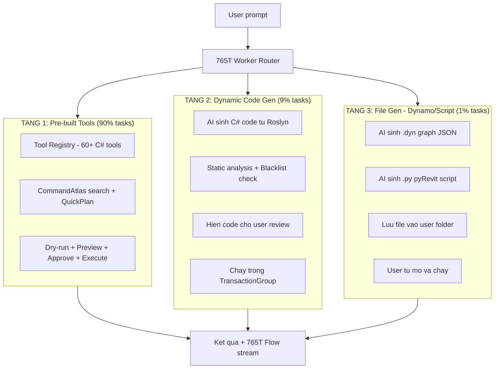
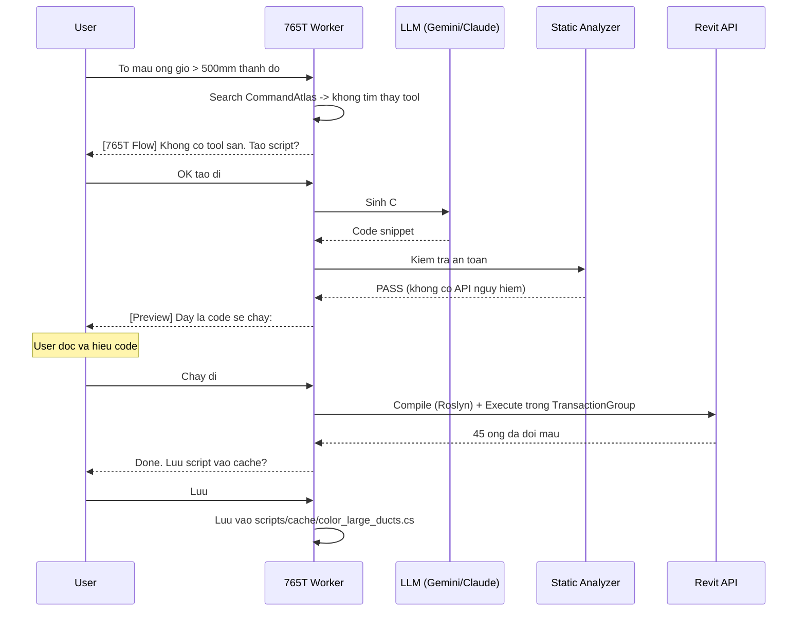
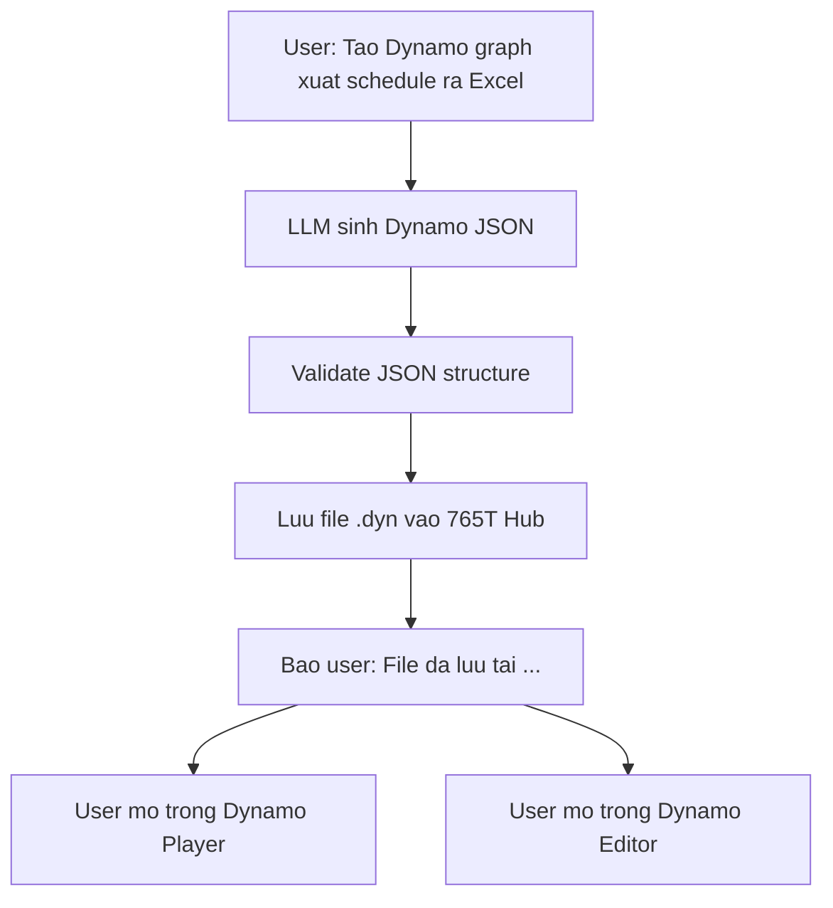
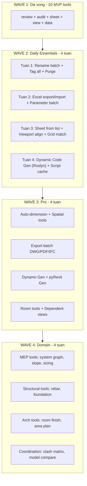

# 765T Tool Library Blueprint — Ship AI Agent tu dan coding sang dan ky thuat

> **Date:** 2026-03-22
> **Purpose:** Blueprint ky thuat de build thu vien tool + dynamic code gen + Dynamo gen
> cho 765T Worker. Day la file de CODE, khong phai de doc suong.

---

## MUC LUC

1. [Danh gia codebase hien tai](#1-danh-gia-codebase)
2. [Nguon logic chat luong cao (Research)](#2-nguon-logic)
3. [Tool Library Architecture — 3 tang](#3-architecture)
4. [Danh sach 60 tool phan theo Wave](#4-danh-sach-tool)
5. [Dynamic Code Gen — Khi tool khong co san](#5-dynamic-code-gen)
6. [Dynamo Graph Gen — Xuat file .dyn cho user](#6-dynamo-gen)
7. [Implementation Plan — File nao code gi](#7-implementation)

---

## 1. Danh gia codebase

### 1a. Hien trang: DA CO 150+ ToolNames, 10 MVP curated

File `ToolNames.cs` (294 dong) da dinh nghia ~150 tool name constants, chia thanh:

| Nhom | So luong | Trang thai |
|---|---|---|
| Session/Worker/Context | ~25 | Da implement |
| Document/View/Selection | ~20 | Da implement |
| Element/Parameter | ~15 | Da implement |
| Sheet/Schedule | ~15 | Da implement (Phase 1A) |
| Audit/Review/QC | ~15 | Da implement (Phase 1C) |
| Query/Spatial | ~18 | Da dinh nghia, can implement |
| Family Authoring | ~20 | Da dinh nghia, can implement |
| Batch/Report/Penetration | ~15 | Da implement (domain-specific) |
| Export/Integration | ~5 | Da dinh nghia |
| Script Orchestration | ~5 | Da dinh nghia |
| Workset/Revision | ~5 | Da dinh nghia |

### 1b. Diem manh cua codebase hien tai

1. **Tool Registry pattern XUAT SAC**: Moi tool co PermissionLevel, ApprovalRequirement,
   ToolManifest (metadata), va payload validation — scale tot
2. **CapabilityPack system**: Tool duoc nhom theo pack (CoreWorker, AutomationLab,
   Connector, MemoryAndSoul) — linh hoat cho plugin
3. **CommandAtlas + QuickPlan**: AI co the search tool theo query, auto-fill context —
   khong can hardcode mapping
4. **MvpCuratedCommandIds**: Cho phep gioi han surface — chi expose tool da verified

### 1c. Gap can lap

| Gap | Mo ta | Muc do |
|---|---|---|
| **Thieu tool "nhu cau hang ngay"** | Rename batch, tag all, purge, copy view setup | Cao |
| **Query tools chua implement** | query.quick_filter, spatial.clash_detect | Trung binh |
| **Family authoring chua implement** | family.create_extrusion_safe, etc | Thap (V2) |
| **Khong co Dynamic Code Gen** | Khi tool khong co san, AI khong the giup | Cao |
| **Khong co Dynamo Gen** | User muon file .dyn, AI khong tao duoc | Trung binh |
| **Khong co Excel read/write** | 90% BIM workflow dung Excel | Cao |

---

## 2. Nguon logic

### 2a. Open-source repos co logic chat luong cao

| Repo | Stars | Ngon ngu | Logic gia tri nhat cho 765T |
|---|---|---|---|
| **TheBuildingCoder Samples** | 400+ | C# | 300+ code snippets cover gan het Revit API |
| **EF-Tools (ErikFrits)** | 178+ | Python | 50+ tool thuc te: rename, copy, purge, align |
| **pyRevitMEP (CyrilWaechter)** | 150+ | Python | MEP-specific: copy pipe types, system tools |
| **RevitPythonShell** | 300+ | Python | IronPython REPL trong Revit, nhieu script mau |
| **Speckle Revit Connector** | 1400+ | C# | Serialize Revit data, convert geometry, BIM data exchange |
| **ricaun.Revit.UI.Tasks** | 50+ | C# | Async/await pattern cho Revit API (thay the Revit.Async) |
| **ricaun.Revit.CefSharp** | 30+ | C# | Dung dung CefSharp version voi Revit |
| **RevitLookup** | 900+ | C# | Inspect moi property/parameter cua BIM element |
| **pyRevitPlus (gtalarico)** | 200+ | Python | Match grids, align elements, batch tools |

### 2b. Paid tools co logic can hoc hoi (khong copy code)

| Tool | Feature hay nhat | Logic 765T nen co |
|---|---|---|
| **Ideate BIMLink** | Export/Import data Revit <-> Excel | Excel connector 2 chieu |
| **Ideate SheetManager** | Batch rename Views/Sheets | Rename engine voi pattern matching |
| **DiRoots ProSheets** | Auto-create sheets tu Excel template | Sheet creation tu template |
| **DiRoots SheetLink** | Export schedules to Excel, push back | Schedule <-> Excel sync |
| **BIM Track** | Issue tracking tich hop Revit | Clash/issue management |
| **Naviate (Symetri)** | Smart tagging, auto-dimension | Tag engine, dimension engine |

### 2c. Logic "thong minh va gia tri cao" can cau tu cac nguon

| Logic | Nguon hoc | Do kho | Gia tri |
|---|---|---|---|
| **Pattern-based batch rename** | EF-Tools, Ideate | De | Rat cao — dung moi ngay |
| **Smart tag all visible** | EF-Tools, Naviate | Trung binh | Cao — tiet kiem gio |
| **Copy View Template config** | pyRevitPlus | De | Cao |
| **Purge unused (safe)** | EF-Tools, pyRevit | De | Cao |
| **Excel <-> Parameter sync** | Ideate BIMLink, DiRoots | Kho | Rat cao |
| **Auto-create Sheets tu list** | DiRoots ProSheets | Trung binh | Cao |
| **Align viewports on sheet** | pyRevitPlus | Trung binh | Cao |
| **Match grid extents** | pyRevitPlus | De | Trung binh |
| **Clash detect (BBox-based)** | TheBuildingCoder | Kho | Cao |
| **Room-based element grouping** | TheBuildingCoder | Trung binh | Cao |
| **Workset reassignment** | pyRevitMEP | De | Trung binh |
| **System graph capture** | Speckle connector | Kho | Cao (MEP) |
| **Auto-dimension walls** | Naviate concept | Rat kho | Rat cao |
| **Smart section box** | EF-Tools | De | Trung binh |
| **Export filtered to DWG/PDF** | TheBuildingCoder | Trung binh | Cao |

---

## 3. Architecture

### 3a. 3-tang tool execution



### 3b. Tool Registration Pattern (da co, can mo rong)

Moi tool moi chi can implement theo pattern co san:

```csharp
// File: src/BIM765T.Revit.Agent/Services/Bridge/[Module]ToolModule.cs

registry.Register(
    ToolNames.ViewRenameBatchSafe,           // Ten tool
    "Batch rename views using pattern.",      // Mo ta cho AI hieu
    PermissionLevel.Mutate,                   // Read / Mutate / Admin
    ApprovalRequirement.PreviewFirst,         // None / PreviewFirst / ExplicitApproval
    false,                                    // autoExecutionEligible
    manifest,                                 // ToolManifest metadata
    (uiapp, request) =>                       // Handler
    {
        var payload = ToolPayloads.Read<BatchRenameViewsRequest>(request);
        // ... logic ...
        return ToolResponses.Success(request, result);
    },
    "{...}"                                   // Example payload JSON
);
```

### 3c. Scale-up: Them tool = them 1 file, KHONG sua core

```
src/BIM765T.Revit.Agent/Services/Bridge/
|-- SessionToolModule.cs          <- Da co
|-- DocumentToolModule.cs         <- Da co
|-- ViewToolModule.cs             <- Da co + MO RONG
|-- SheetToolModule.cs            <- Da co + MO RONG
|-- ElementToolModule.cs          <- Da co
|-- ParameterToolModule.cs        <- Da co + MO RONG
|-- ReviewToolModule.cs           <- Da co + MO RONG
|-- AuditToolModule.cs            <- MO RONG
|-- DataToolModule.cs             <- MO RONG (Excel)
|-- SpatialToolModule.cs          <- MOI
|-- TagToolModule.cs              <- MOI
|-- DimensionToolModule.cs        <- MOI
|-- PurgeToolModule.cs            <- MOI
|-- ExportToolModule.cs           <- MO RONG
|-- DynamicCodeToolModule.cs      <- MOI (Tang 2)
|-- FileGenToolModule.cs          <- MOI (Tang 3)
```

---

## 4. Danh sach tool

### Wave 1 — MVP (da implement hoac gan xong): 10 tools

| # | Tool | Status |
|---|---|---|
| 1 | `review.model_health` | Done |
| 2 | `review.smart_qc` | Done |
| 3 | `review.sheet_summary` | Done |
| 4 | `audit.naming_convention` | Done |
| 5 | `view.create_3d_safe` | Done |
| 6 | `view.duplicate_safe` | Done |
| 7 | `sheet.create_safe` | Done |
| 8 | `sheet.place_views_safe` | Done |
| 9 | `sheet.renumber_safe` | Done |
| 10 | `data.export_schedule` | Done |

### Wave 2 — Daily Essentials: 20 tools (HIGH PRIORITY)

> Day la 20 tool ma MOLI BIMER dung HANG NGAY. Ship xong Wave 2 = user se dung daily.

| # | Tool | Logic | Nguon tham khao | Do kho |
|---|---|---|---|---|
| 11 | `view.rename_batch_safe` | Rename nhieu View theo pattern | EF-Tools, Ideate | De |
| 12 | `view.copy_template_safe` | Copy View Template tu view nay sang view khac | pyRevitPlus | De |
| 13 | `view.close_inactive_safe` | Dong cac view khong dung de giam RAM | EF-Tools | De |
| 14 | `tag.all_visible_safe` | Tag tat ca element nhin thay trong active view | EF-Tools, Naviate | TB |
| 15 | `tag.room_tag_all_safe` | Dat tag cho tat ca Room chua co tag | pyRevit | De |
| 16 | `sheet.create_from_list_safe` | Tao nhieu sheet tu danh sach (Excel/CSV) | DiRoots concept | TB |
| 17 | `sheet.rename_batch_safe` | Doi ten/so nhieu sheet 1 luc | Ideate | De |
| 18 | `viewport.align_safe` | Can chinh viewport tren sheet | pyRevitPlus | TB |
| 19 | `parameter.batch_fill_safe` | Dien parameter cho nhieu element | BIMLink concept | De |
| 20 | `parameter.copy_between_safe` | Copy parameter value tu element nay sang element khac | EF-Tools | De |
| 21 | `audit.purge_unused_safe` | Xoa family/view/material khong dung (co preview) | pyRevit, EF-Tools | De |
| 22 | `audit.unused_views` | Liet ke Views khong nam tren Sheet nao | EF-Tools | De |
| 23 | `audit.duplicate_elements` | Tim element bi trung (cung vi tri) | TheBuildingCoder | TB |
| 24 | `element.select_by_parameter` | Chon element theo dieu kien parameter | Revit API filter | De |
| 25 | `element.isolate_in_view_safe` | Isolate nhom element trong active view | pyRevit | De |
| 26 | `data.export_to_excel` | Export bat ky data nao ra Excel | DiRoots, BIMLink | TB |
| 27 | `data.import_from_excel_safe` | Import data tu Excel vao Revit parameters | BIMLink concept | Kho |
| 28 | `grid.match_extents_safe` | Dong bo chieu dai grid giua cac view | pyRevitPlus | De |
| 29 | `level.copy_monitoring_report` | Bao cao tinh trang Copy/Monitor levels | TheBuildingCoder | TB |
| 30 | `link.status_report` | Bao cao trang thai tat ca linked models | Da co (review.links_status) | De |

### Wave 3 — Pro Productivity: 15 tools

| # | Tool | Logic | Do kho |
|---|---|---|---|
| 31 | `dim.auto_walls_safe` | Tu dong dat dimension cho tuong trong view | Rat kho |
| 32 | `dim.auto_grids_safe` | Tu dong dimension grid lines | Kho |
| 33 | `spatial.section_box_from_elements` | Tao section box tu nhom element | De |
| 34 | `spatial.clash_detect` | Phat hien va cham giua 2 nhom (BBox) | Kho |
| 35 | `spatial.proximity_search` | Tim element gan 1 diem/element | TB |
| 36 | `room.area_report` | Bao cao dien tich phong theo tang/zone | TB |
| 37 | `room.assign_elements` | Gan element vao Room theo vi tri | TB |
| 38 | `workset.bulk_reassign_safe` | Chuyen nhieu element sang workset khac | De |
| 39 | `revision.create_safe` | Tao revision moi voi thong tin | De |
| 40 | `export.dwg_batch_safe` | Export nhieu sheet ra DWG 1 luc | TB |
| 41 | `export.pdf_batch_safe` | Export nhieu sheet ra PDF 1 luc | TB |
| 42 | `export.ifc_safe` | Export IFC voi cau hinh chuan | TB |
| 43 | `schedule.create_from_template_safe` | Tao schedule tu template JSON | TB |
| 44 | `annotation.keynote_report` | Bao cao su dung keynote trong model | De |
| 45 | `view.create_dependent_safe` | Tao dependent views theo zone/grid | TB |

### Wave 4 — Domain-Specific: 15 tools

| # | Tool | Domain | Do kho |
|---|---|---|---|
| 46 | `mep.system_graph` | MEP system connectivity | Kho |
| 47 | `mep.pipe_slope_check` | Kiem tra do doc ong | TB |
| 48 | `mep.duct_size_report` | Bao cao kich thuoc ong gio | De |
| 49 | `mep.penetration_report` | Bao cao lo mo xuyen ket cau | Da co |
| 50 | `structural.rebar_schedule` | Trich xuat bang thep | Kho |
| 51 | `structural.foundation_report` | Bao cao mong theo loai | TB |
| 52 | `arch.room_finish_schedule` | Bang hoan thien phong | TB |
| 53 | `arch.door_window_schedule` | Bang cua di/cua so | De |
| 54 | `arch.area_plan_report` | Bao cao mat bang theo tang | TB |
| 55 | `family.xray` | Phan tich chi tiet family | Da co |
| 56 | `family.batch_parameter_add_safe` | Them parameter cho nhieu family | Kho |
| 57 | `family.type_catalog_export` | Xuat type catalog ra TXT | TB |
| 58 | `coordination.clash_matrix` | Ma tran clash giua cac discipline | Kho |
| 59 | `coordination.model_compare` | So sanh 2 phien ban model | Rat kho |
| 60 | `integration.speckle_push_safe` | Day data len Speckle server | TB |

---

## 5. Dynamic Code Gen

> Khi tool khong co san, AI sinh code C# va cho user review truoc khi chay.

### 5a. Flow Dynamic Code Gen



### 5b. Static Analyzer — Blacklist API nguy hiem

```csharp
// File moi: src/BIM765T.Revit.Agent.Core/Safety/ScriptStaticAnalyzer.cs

public static class ScriptBlacklist
{
    // TUYET DOI KHONG cho phep
    public static readonly string[] ForbiddenApis = new[]
    {
        "Document.Close",
        "Document.Save(",           // Chi cho phep qua file.save_document tool
        "SynchronizeWithCentral",
        "Document.Delete",
        "Application.OpenDocumentFile",
        "File.Delete",
        "File.Move",
        "Directory.Delete",
        "Process.Start",
        "System.Net.",
        "System.IO.File.WriteAllText",  // Chi cho phep ghi vao 765T Hub
        "WebClient",
        "HttpClient",
        "Assembly.Load",
        "Activator.CreateInstance",
        "Environment.Exit"
    };

    // CANH BAO nhung van cho phep neu user dong y
    public static readonly string[] WarningApis = new[]
    {
        "Transaction",            // Can co nhung phai trong TransactionGroup
        "Element.Delete",         // Cho phep nhung canh bao truoc
        "FilteredElementCollector.WhereElementIsNotElementType",  // Co the cham
    };
}
```

### 5c. Roslyn Compilation Helper

```csharp
// File moi: src/BIM765T.Revit.Agent.Core/Scripting/RoslynScriptRunner.cs

public sealed class RoslynScriptRunner
{
    // Cac assembly cho phep reference
    private static readonly string[] AllowedAssemblies = new[]
    {
        "RevitAPI.dll",
        "RevitAPIUI.dll",
        "System.dll",
        "System.Core.dll",
        "System.Linq.dll",
        "System.Collections.dll",
        "BIM765T.Revit.Contracts.dll"  // De dung DTOs
    };

    public ScriptCompileResult Compile(string code)
    {
        // 1. Parse code
        // 2. Check blacklist
        // 3. Compile voi Roslyn
        // 4. Tra ve compiled assembly hoac error
    }

    public ScriptRunResult Execute(
        Assembly compiled,
        UIApplication uiApp,
        TransactionGroup txGroup)
    {
        // 1. Mo TransactionGroup
        // 2. Chay code trong try/catch
        // 3. Neu exception -> RollBack
        // 4. Neu ok -> tra ve ket qua (CHUA commit, cho user approve)
    }
}
```

---

## 6. Dynamo Gen

> AI tao file .dyn (Dynamo graph JSON) va luu cho user tu mo.

### 6a. Dynamo graph la gi ve mat ky thuat?

File .dyn la JSON voi cau truc:

```json
{
  "Uuid": "...",
  "IsCustomNode": false,
  "Description": "Auto-generated by 765T Worker",
  "Name": "ColorLargeDucts",
  "Nodes": [
    {
      "Id": "node-1",
      "NodeType": "FunctionNode",
      "FunctionSignature": "Revit.Elements.Element.SetParameterByName@string,var",
      "Inputs": [...],
      "Outputs": [...]
    }
  ],
  "Connectors": [
    { "Start": "node-1:0", "End": "node-2:0" }
  ],
  "Notes": [],
  "View": { "Dynamo": { "ScaleFactor": 1.0 } }
}
```

### 6b. 765T Dynamo Gen strategy



**Gioi han thuc te:**
- AI sinh Dynamo JSON KHONG dam bao 100% chay dung (node ID, version, package dependency)
- Nen co bo TEMPLATE .dyn cho cac task pho bien (10-15 template)
- AI chi DIEN PARAMETER vao template, khong sinh tu dau
- Template-based = 95% chinh xac, sinh tu dau = 60% chinh xac

### 6c. Dynamo Template Library

| # | Template | Nodes chinh | User input |
|---|---|---|---|
| 1 | `export_schedule_to_excel.dyn` | GetSchedule, ExportToExcel | Schedule name, file path |
| 2 | `rename_elements_by_parameter.dyn` | FilterByCategory, SetParameter | Category, pattern |
| 3 | `create_sheets_from_excel.dyn` | ReadExcel, CreateSheet | Excel path, sheet name col |
| 4 | `tag_all_elements_in_view.dyn` | GetViewElements, PlaceTag | Category, tag type |
| 5 | `color_elements_by_parameter.dyn` | FilterByParam, OverrideColor | Param name, value, color |
| 6 | `export_room_areas.dyn` | GetRooms, ExportCSV | Level filter, output path |
| 7 | `batch_print_sheets.dyn` | GetSheets, PrintPDF | Sheet filter, printer name |
| 8 | `copy_view_to_sheets.dyn` | DuplicateView, PlaceOnSheet | View, sheet list |
| 9 | `align_grid_extents.dyn` | GetGrids, SetExtents | Source view |
| 10 | `parameter_value_report.dyn` | GetElements, GetParams, Export | Category, param list |

---

## 7. Implementation Plan

### 7a. File moi can tao

```
src/BIM765T.Revit.Contracts/Bridge/
  ToolNames.cs                         <- THEM 20 tool names Wave 2
  BatchRenameRequest.cs                <- MOI: payload cho batch rename
  TagAllVisibleRequest.cs              <- MOI: payload cho tag all
  ExcelExportRequest.cs                <- MOI: payload cho Excel export
  ExcelImportRequest.cs                <- MOI: payload cho Excel import
  DynamicScriptRequest.cs              <- MOI: payload cho dynamic code
  DynamoGenRequest.cs                  <- MOI: payload cho dynamo gen

src/BIM765T.Revit.Agent/Services/Bridge/
  ViewToolModule.cs                    <- THEM: rename_batch, copy_template, close_inactive
  SheetToolModule.cs                   <- THEM: create_from_list, rename_batch
  TagToolModule.cs                     <- MOI: tag_all_visible, room_tag_all
  ParameterToolModule.cs               <- THEM: batch_fill (da co), copy_between
  AuditToolModule.cs                   <- MOI: purge_unused, unused_views, duplicate_elements
  DataToolModule.cs                    <- MOI: export_to_excel, import_from_excel
  ElementToolModule.cs                 <- THEM: select_by_parameter, isolate_in_view
  GridToolModule.cs                    <- MOI: match_extents
  ViewportToolModule.cs                <- MOI: align
  DynamicCodeToolModule.cs             <- MOI: compile, execute, cache script
  FileGenToolModule.cs                 <- MOI: gen_dynamo, gen_pyrevit_script

src/BIM765T.Revit.Agent.Core/
  Safety/ScriptStaticAnalyzer.cs       <- MOI: blacklist check
  Scripting/RoslynScriptRunner.cs      <- MOI: compile + execute
  Scripting/DynamoGraphBuilder.cs      <- MOI: sinh .dyn JSON
  Scripting/PyRevitScriptBuilder.cs    <- MOI: sinh .py script
  Scripting/ScriptCacheService.cs      <- MOI: luu/tim script da chay

src/BIM765T.Revit.Copilot.Core/
  CommandAtlasService.cs               <- THEM 20 command entries Wave 2

templates/dynamo/
  export_schedule_to_excel.dyn         <- Template Dynamo
  rename_elements_by_parameter.dyn
  create_sheets_from_excel.dyn
  ... (10 templates)

templates/pyrevit/
  batch_rename_views.py                <- Template pyRevit script
  tag_all_in_view.py
  purge_unused.py
  ... (10 templates)
```

### 7b. Thu tu implement



### 7c. Tieu chi "DONE" cho moi tool

Moi tool PHAI co:

- [ ] **ToolName constant** trong `ToolNames.cs`
- [ ] **Request DTO** voi `[DataContract]` + `[DataMember(Order=N)]`
- [ ] **Response DTO** (hoac dung chung `ToolResponse`)
- [ ] **Registration** trong ToolModule voi dung PermissionLevel + ApprovalRequirement
- [ ] **Dry-run / Preview** cho moi mutation tool
- [ ] **Example payload JSON** de AI biet cach goi
- [ ] **CommandAtlas entry** (hoac auto-generate tu ToolManifest)
- [ ] **Unit test** cho DTO roundtrip
- [ ] **Integration test** (chay tren Revit that hoac mock)

### 7d. Priority Matrix — Build gi truoc?

```
                    GIA TRI CAO                     GIA TRI THAP
                    ┌─────────────────────────────────────────────┐
    DE LAM          │ rename_batch     tag_all      │ grid_match  │
                    │ purge_unused     unused_views  │ close_views │
                    │ select_by_param  isolate       │ revision    │
                    ├─────────────────────────────────────────────┤
    KHO LAM         │ excel_export    excel_import   │ clash_detect│
                    │ sheet_from_list  dynamic_code  │ auto_dim    │
                    │ dynamo_gen      viewport_align │ model_compare│
                    └─────────────────────────────────────────────┘

    → Bat dau tu goc tren-trai: DE LAM + GIA TRI CAO
```

---

## Ket luan

Codebase hien tai DA DU tot ve mat architecture (ToolRegistry, CommandAtlas, CapabilityPack).
Van de khong phai kien truc ma la SO LUONG TOOL.

**Muc tieu:**
- Wave 2 (20 tools) → User dung hang ngay
- Wave 3 (15 tools + Dynamic Gen) → User cam thay "765T lam duoc moi thu"
- Wave 4 (15 tools domain) → Chuyen gia tung mang

**"Ship AI agent tu dan coding sang dan ky thuat"** = cung cap 60 tool san
ma BIMer chi can NOI la AI lam. Khong can biet code. Khong can cai pyRevit.
Khong can hoc Dynamo. Chi can chat.
